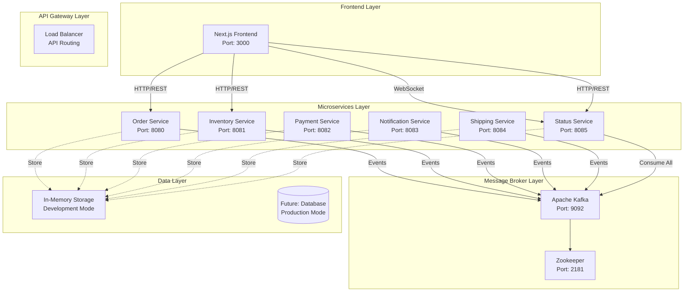
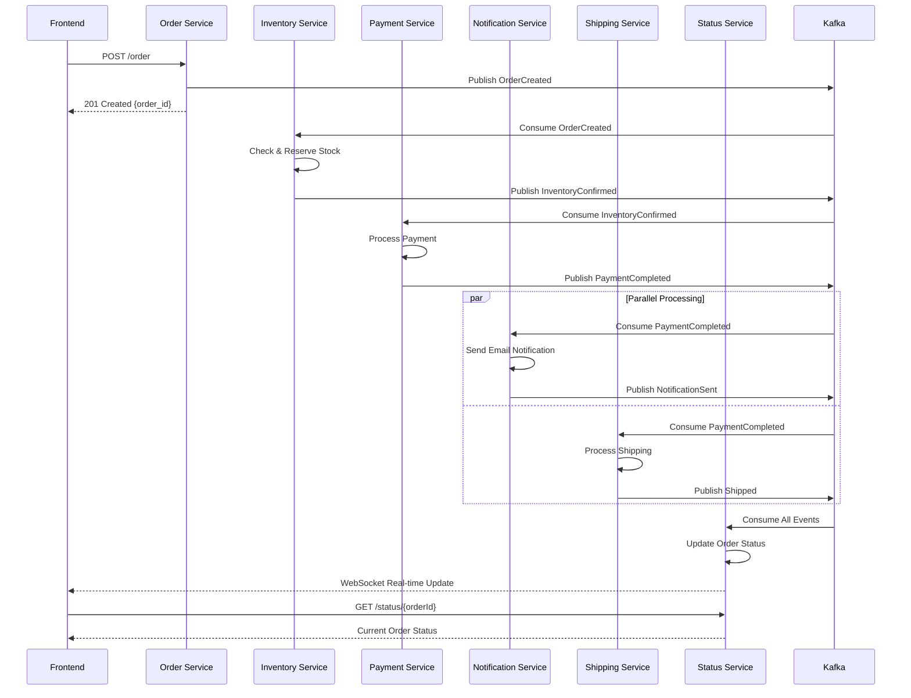
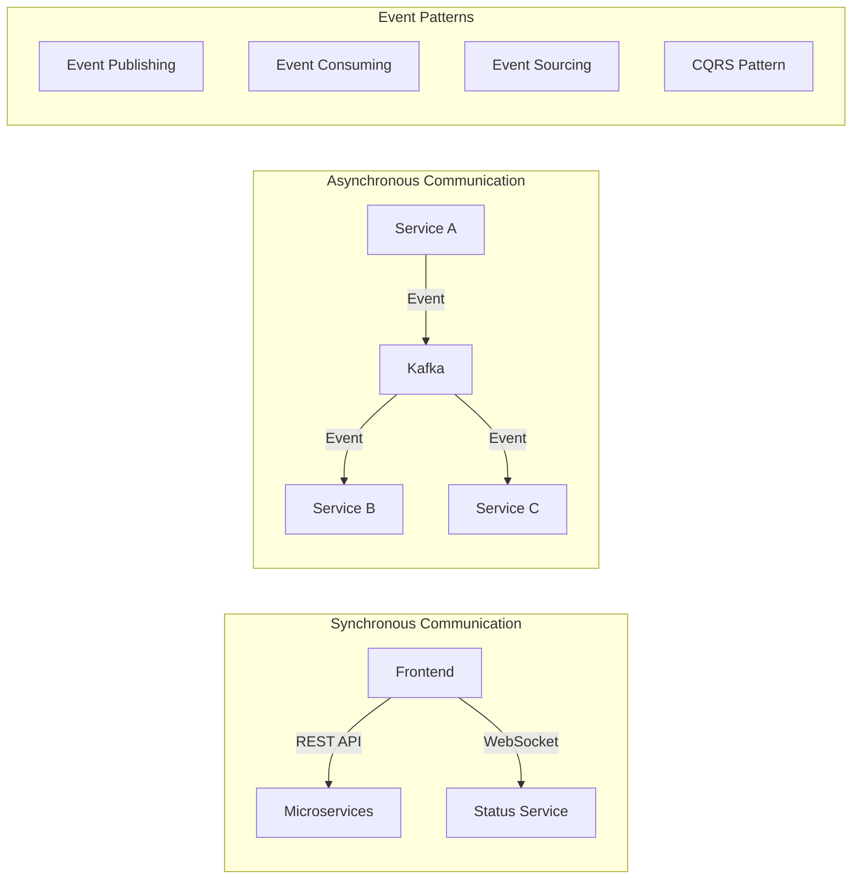
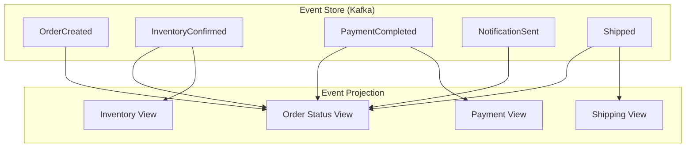
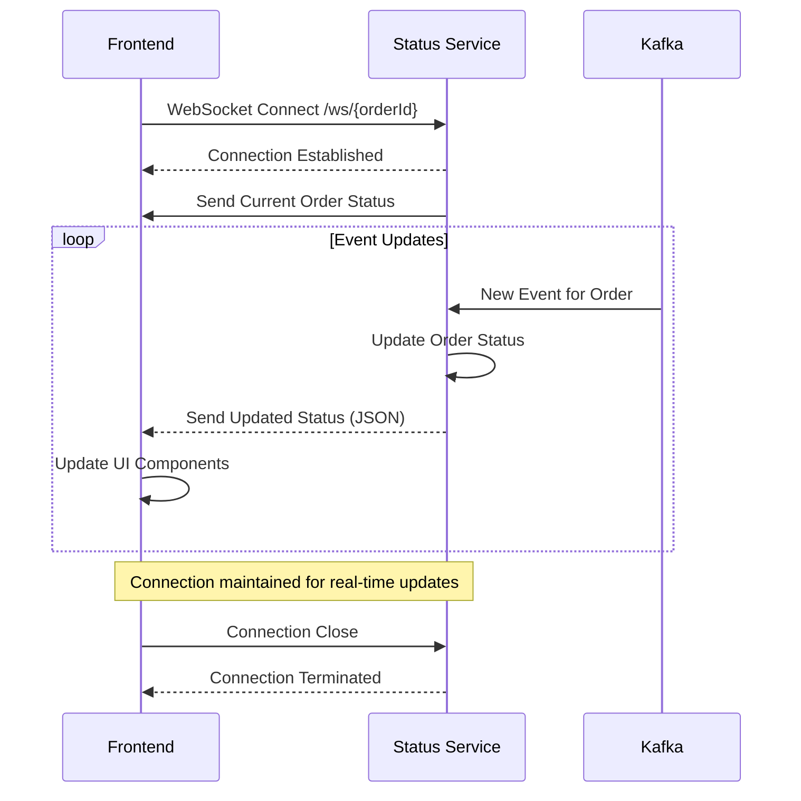
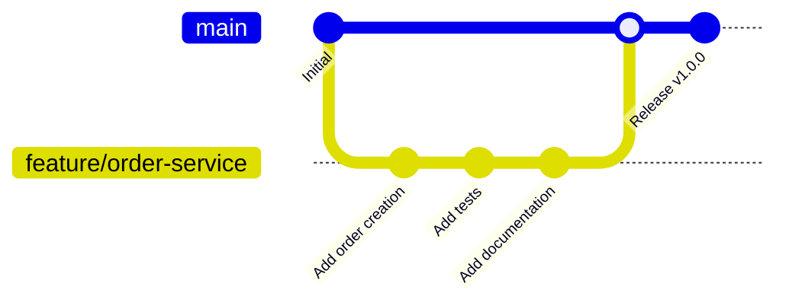

# 🚀 Event-Driven E-Commerce System - Architecture Design Document

## 📋 Table of Contents

- [1. System Overview](#1-system-overview)
- [2. Architecture Design](#2-architecture-design)
- [3. Service Specifications](#3-service-specifications)
- [4. Event Flow Design](#4-event-flow-design)
- [5. Technology Stack](#5-technology-stack)
- [6. Database & Storage](#6-database--storage)
- [7. API Documentation](#7-api-documentation)
- [8. WebSocket Communication](#8-websocket-communication)
- [9. Deployment Architecture](#9-deployment-architecture)
- [10. Security Considerations](#10-security-considerations)
- [11. Monitoring & Observability](#11-monitoring--observability)
- [12. Development Guidelines](#12-development-guidelines)

---

## 1. System Overview

### 1.1 Purpose

This system demonstrates a **modern event-driven microservices architecture** for an e-commerce platform, featuring:

- **Real-time order processing** through Kafka event streams
- **Microservices** implemented in Go with Gin framework
- **Real-time UI updates** via WebSocket connections
- **Container-based deployment** with Docker and Kubernetes
- **Scalable and resilient architecture** with event sourcing patterns

### 1.2 Key Features

- ✅ **Event-Driven Architecture**: All services communicate via Kafka events
- ✅ **Real-time Updates**: WebSocket integration for live order tracking
- ✅ **Microservices**: Independent, loosely-coupled services
- ✅ **Container Native**: Full Docker & Kubernetes support
- ✅ **Modern UI**: React/Next.js with Tailwind CSS
- ✅ **Type Safety**: TypeScript for frontend, Go for backend
- ✅ **Cloud Ready**: AWS EKS deployment ready

---

## 2. Architecture Design

### 2.1 High-Level System Architecture



### 2.2 Event-Driven Flow Architecture



### 2.3 Service Communication Patterns



---

## 3. Service Specifications

### 3.1 Order Service

**Purpose**: Handle order creation and initiate the order processing workflow

**Technical Stack**:
- Language: Go 1.21+
- Framework: Gin
- Kafka Client: github.com/segmentio/kafka-go
- UUID Generation: github.com/google/uuid

**API Endpoints**:
```http
POST /order
GET /health
```

**Event Production**:
- Topic: `orders`
- Event: `OrderCreated`

**Data Model**:
```go
type OrderRequest struct {
    ProductID string `json:"product_id" binding:"required"`
    Quantity  int    `json:"quantity" binding:"required,min=1"`
}

type OrderCreatedEvent struct {
    OrderID   string `json:"order_id"`
    ProductID string `json:"product_id"`
    Quantity  int    `json:"quantity"`
    EventType string `json:"event_type"`
}
```

### 3.2 Inventory Service

**Purpose**: Manage product inventory and stock reservations

**Event Consumption**:
- Topic: `orders`
- Event: `OrderCreated`

**Event Production**:
- Topic: `inventory`
- Events: `InventoryConfirmed`, `InventoryRejected`

**Business Logic**:
```go
// Initial Stock Configuration
inventory := map[string]int{
    "product-1": 100,  // Premium Widget
    "product-2": 50,   // Deluxe Gadget  
    "product-3": 25,   // Elite Device
}

// Stock Reservation Algorithm
func ReserveStock(productID string, quantity int) bool {
    if currentStock >= requestedQuantity {
        currentStock -= requestedQuantity
        return true // InventoryConfirmed
    }
    return false // InventoryRejected
}
```

### 3.3 Payment Service

**Purpose**: Process payments and handle payment-related operations

**Event Consumption**:
- Topic: `inventory`
- Event: `InventoryConfirmed`

**Event Production**:
- Topic: `payment`
- Events: `PaymentCompleted`, `PaymentFailed`

**Payment Logic**:
```go
// Product Pricing
var productPrices = map[string]float64{
    "product-1": 29.99,
    "product-2": 49.99,
    "product-3": 99.99,
}

// Payment Success Rate: 95%
// Random payment failures for demonstration
```

### 3.4 Notification Service

**Purpose**: Send notifications to customers about order updates

**Event Consumption**:
- Topic: `payment`
- Event: `PaymentCompleted`

**Event Production**:
- Topic: `notification`
- Event: `NotificationSent`

**Notification Channels**:
- Email (simulated)
- SMS (future implementation)
- Push Notifications (future implementation)

### 3.5 Shipping Service

**Purpose**: Handle shipping logistics and tracking

**Event Consumption**:
- Topic: `payment`
- Event: `PaymentCompleted`

**Event Production**:
- Topic: `shipping`
- Event: `Shipped`

**Shipping Features**:
```go
// Carrier Selection
carriers := []string{"FedEx", "UPS", "DHL", "USPS"}

// Tracking Number Generation
trackingNumber := "TRK" + uuid.New().String()[:8]

// Estimated Delivery Calculation
estimatedDays := quantity > 5 ? 5 : 3
```

### 3.6 Status Service

**Purpose**: Aggregate all events and provide real-time order status tracking

**Event Consumption**:
- Topics: `orders`, `inventory`, `payment`, `notification`, `shipping`
- Events: All system events

**API Endpoints**:
```http
GET /status/{orderId}    # Get specific order status
GET /orders              # Get all orders
GET /ws/{orderId}        # WebSocket connection for real-time updates
GET /health
```

**WebSocket Communication**:
- Real-time order status updates
- Event-driven status changes
- Automatic reconnection handling

---

## 4. Event Flow Design

### 4.1 Event Schema Design

```json
{
  "event_schema": {
    "order_created": {
      "order_id": "uuid",
      "product_id": "string",
      "quantity": "integer",
      "event_type": "OrderCreated",
      "timestamp": "ISO8601"
    },
    "inventory_confirmed": {
      "order_id": "uuid",
      "product_id": "string",
      "quantity": "integer",
      "event_type": "InventoryConfirmed",
      "timestamp": "ISO8601"
    },
    "payment_completed": {
      "order_id": "uuid",
      "product_id": "string",
      "quantity": "integer",
      "amount": "float64",
      "event_type": "PaymentCompleted",
      "processed_at": "ISO8601",
      "timestamp": "ISO8601"
    },
    "shipped": {
      "order_id": "uuid",
      "product_id": "string",
      "quantity": "integer",
      "tracking_number": "string",
      "carrier": "string",
      "estimated_delivery_days": "integer",
      "event_type": "Shipped",
      "shipped_at": "ISO8601",
      "timestamp": "ISO8601"
    }
  }
}
```

### 4.2 Kafka Topic Configuration

```yaml
topics:
  orders:
    partitions: 3
    replication_factor: 1
    retention_ms: 604800000  # 7 days
    
  inventory:
    partitions: 3
    replication_factor: 1
    retention_ms: 604800000
    
  payment:
    partitions: 3
    replication_factor: 1
    retention_ms: 604800000
    
  notification:
    partitions: 3
    replication_factor: 1
    retention_ms: 604800000
    
  shipping:
    partitions: 3
    replication_factor: 1
    retention_ms: 604800000
```

### 4.3 Event Sourcing Pattern



---

## 5. Technology Stack

### 5.1 Backend Technologies

```yaml
languages:
  primary: Go 1.21+
  
frameworks:
  web: Gin (github.com/gin-gonic/gin v1.9.1)
  
messaging:
  broker: Apache Kafka
  client: github.com/segmentio/kafka-go v0.4.47
  
utilities:
  uuid: github.com/google/uuid v1.4.0
  websocket: github.com/gorilla/websocket v1.5.1
  
containerization:
  runtime: Docker
  orchestration: Kubernetes
  
development:
  build_tool: Docker Multi-stage builds
  package_manager: Go Modules
```

### 5.2 Frontend Technologies

```yaml
languages:
  primary: TypeScript
  
frameworks:
  ui: Next.js 14.0.0
  react: React 18.2.0
  
styling:
  css: Tailwind CSS 3.3.0
  icons: Lucide React 0.292.0
  
http_client:
  library: Axios 1.6.0
  
development:
  bundler: Next.js built-in
  package_manager: npm
```

### 5.3 Infrastructure Technologies

```yaml
message_broker:
  kafka: Confluent Kafka 7.4.0
  zookeeper: Confluent Zookeeper 7.4.0
  
containerization:
  docker: Docker Engine
  compose: Docker Compose
  
orchestration:
  local: kind/minikube
  cloud: AWS EKS
  operators: Strimzi (Kafka)
  
networking:
  ingress: NGINX Ingress Controller
  service_mesh: Future (Istio consideration)
```

---

## 6. Database & Storage

### 6.1 Current Storage Strategy (Development)

```yaml
storage_type: In-Memory
persistence: None (Ephemeral)
data_structures:
  inventory: map[string]int
  orders: map[string]Order
  events: []EventRecord
  
limitations:
  - Data loss on service restart
  - No persistent storage
  - Single instance only
```

### 6.2 Production Storage Design (Future)

```yaml
primary_database:
  type: PostgreSQL
  purpose: Transactional data
  tables:
    - orders
    - inventory
    - payments
    - shipments
    
event_store:
  type: Apache Kafka
  purpose: Event sourcing
  retention: 30 days
  
cache_layer:
  type: Redis
  purpose: Session, real-time data
  
search_engine:
  type: Elasticsearch
  purpose: Order search, analytics
```

### 6.3 Data Models

```go
// Core Domain Models
type Order struct {
    OrderID       string            `json:"order_id"`
    ProductID     string            `json:"product_id"`
    Quantity      int               `json:"quantity"`
    Status        string            `json:"status"`
    Events        []EventRecord     `json:"events"`
    LastUpdated   time.Time         `json:"last_updated"`
    TrackingNumber string           `json:"tracking_number,omitempty"`
    PaymentAmount  float64          `json:"payment_amount,omitempty"`
}

type EventRecord struct {
    EventType string    `json:"event_type"`
    Data      string    `json:"data"`
    Timestamp time.Time `json:"timestamp"`
}

// Status Enumeration
type OrderStatus string
const (
    StatusCreated           OrderStatus = "created"
    StatusInventoryConfirmed OrderStatus = "inventory_confirmed"
    StatusInventoryRejected  OrderStatus = "inventory_rejected"
    StatusPaymentCompleted   OrderStatus = "payment_completed"
    StatusPaymentFailed      OrderStatus = "payment_failed"
    StatusNotificationSent   OrderStatus = "notification_sent"
    StatusShipped           OrderStatus = "shipped"
)
```

---

## 7. API Documentation

### 7.1 REST API Endpoints

#### Order Service API
```yaml
base_url: http://localhost:8080

endpoints:
  create_order:
    method: POST
    path: /order
    request_body:
      product_id: string (required)
      quantity: integer (required, min=1)
    responses:
      201:
        order_id: string
        product_id: string  
        quantity: integer
        status: string
      400:
        error: string
      500:
        error: string
        
  health_check:
    method: GET
    path: /health
    responses:
      200:
        status: "healthy"
        service: "order-service"
```

#### Status Service API
```yaml
base_url: http://localhost:8085

endpoints:
  get_order_status:
    method: GET
    path: /status/{orderId}
    parameters:
      orderId: string (path, required)
    responses:
      200: Order (full object with events)
      404: 
        error: "Order not found"
        
  get_all_orders:
    method: GET
    path: /orders
    responses:
      200:
        orders: map[string]Order
        
  websocket_connection:
    method: GET (Upgrade)
    path: /ws/{orderId}
    protocol: WebSocket
    purpose: Real-time order updates
```

#### Inventory Service API
```yaml
base_url: http://localhost:8081

endpoints:
  get_inventory:
    method: GET
    path: /inventory
    responses:
      200:
        inventory: map[string]integer
        
  health_check:
    method: GET
    path: /health
    responses:
      200:
        status: "healthy"
        service: "inventory-service"
```

### 7.2 Frontend API Proxy

```yaml
next_js_rewrites:
  - source: /api/order
    destination: http://order-service:8080/order
    
  - source: /api/inventory
    destination: http://inventory-service:8081/inventory
    
  - source: /api/status/:path*
    destination: http://status-service:8085/status/:path*
    
  - source: /api/orders
    destination: http://status-service:8085/orders
    
  - source: /api/shipments
    destination: http://shipping-service:8084/shipments
```

---

## 8. WebSocket Communication

### 8.1 WebSocket Connection Flow



### 8.2 WebSocket Client Implementation

```typescript
export class WebSocketClient {
  private ws: WebSocket | null = null;
  private orderId: string;
  private onMessage: (order: Order) => void;
  private reconnectAttempts = 0;
  private maxReconnectAttempts = 5;

  constructor(
    orderId: string, 
    onMessage: (order: Order) => void,
    onError: (error: Event) => void
  ) {
    this.orderId = orderId;
    this.onMessage = onMessage;
  }

  connect() {
    const hostname = window.location.hostname;
    const wsUrl = `ws://${hostname}:8085/ws/${this.orderId}`;
    this.ws = new WebSocket(wsUrl);
    
    this.ws.onopen = () => {
      this.reconnectAttempts = 0;
    };
    
    this.ws.onmessage = (event) => {
      const order: Order = JSON.parse(event.data);
      this.onMessage(order);
    };
    
    this.ws.onclose = () => {
      this.attemptReconnect();
    };
  }
  
  private attemptReconnect() {
    if (this.reconnectAttempts < this.maxReconnectAttempts) {
      this.reconnectAttempts++;
      setTimeout(() => {
        this.connect();
      }, 2000 * this.reconnectAttempts);
    }
  }
}
```

### 8.3 Real-time UI Updates

```typescript
// React Hook for WebSocket Integration
function useOrderTracking(orderId: string) {
  const [order, setOrder] = useState<Order | null>(null);
  const [connected, setConnected] = useState(false);
  
  useEffect(() => {
    const wsClient = new WebSocketClient(
      orderId,
      (updatedOrder: Order) => {
        setOrder(updatedOrder);
        setConnected(true);
      },
      (error: Event) => {
        setConnected(false);
      }
    );
    
    wsClient.connect();
    
    return () => {
      wsClient.disconnect();
    };
  }, [orderId]);
  
  return { order, connected };
}
```

---

## 9. Deployment Architecture

### 9.1 Local Development (Docker Compose)

```yaml
# docker-compose.yml structure
services:
  zookeeper:
    image: confluentinc/cp-zookeeper:7.4.0
    ports: ["2181:2181"]
    
  kafka:
    image: confluentinc/cp-kafka:7.4.0
    ports: ["9092:9092"]
    depends_on: [zookeeper]
    
  order-service:
    build: ./services/order-service
    ports: ["8080:8080"]
    depends_on: [kafka]
    
  inventory-service:
    build: ./services/inventory-service
    ports: ["8081:8081"]
    depends_on: [kafka]
    
  # ... other services
  
  frontend:
    build: ./frontend
    ports: ["3000:3000"]
    depends_on: [order-service, status-service]
```

### 9.2 Kubernetes Deployment

```yaml
# Kubernetes Architecture
apiVersion: v1
kind: Namespace
metadata:
  name: ecommerce-system
  
---
# Kafka Deployment (Strimzi Operator)
apiVersion: kafka.strimzi.io/v1beta2
kind: Kafka
metadata:
  name: my-cluster
  namespace: ecommerce-system
spec:
  kafka:
    replicas: 3
    listeners:
      - name: plain
        port: 9092
        type: internal
        tls: false
  zookeeper:
    replicas: 3
    
---
# Microservice Deployment Template
apiVersion: apps/v1
kind: Deployment
metadata:
  name: order-service
  namespace: ecommerce-system
spec:
  replicas: 2
  selector:
    matchLabels:
      app: order-service
  template:
    metadata:
      labels:
        app: order-service
    spec:
      containers:
      - name: order-service
        image: order-service:latest
        ports:
        - containerPort: 8080
        env:
        - name: KAFKA_BROKER
          value: "my-cluster-kafka-bootstrap.ecommerce-system.svc.cluster.local:9092"
        resources:
          requests:
            cpu: 100m
            memory: 128Mi
          limits:
            cpu: 500m
            memory: 512Mi
```

### 9.3 AWS EKS Deployment

```yaml
# EKS Cluster Configuration
cluster_config:
  name: ecommerce-eks
  version: "1.28"
  region: us-west-2
  
  node_groups:
    - name: microservices
      instance_types: ["t3.medium"]
      min_size: 2
      max_size: 10
      desired_size: 4
      
  addons:
    - aws-load-balancer-controller
    - aws-ebs-csi-driver
    - cluster-autoscaler
    
# Application Load Balancer
apiVersion: networking.k8s.io/v1
kind: Ingress
metadata:
  name: ecommerce-ingress
  annotations:
    kubernetes.io/ingress.class: alb
    alb.ingress.kubernetes.io/scheme: internet-facing
    alb.ingress.kubernetes.io/target-type: ip
spec:
  rules:
  - host: api.ecommerce.example.com
    http:
      paths:
      - path: /order
        pathType: Prefix
        backend:
          service:
            name: order-service
            port:
              number: 8080
  - host: app.ecommerce.example.com
    http:
      paths:
      - path: /
        pathType: Prefix
        backend:
          service:
            name: frontend
            port:
              number: 3000
```

---

## 10. Security Considerations

### 10.1 Current Security Implementation

```yaml
authentication:
  status: Not Implemented (Development)
  future: JWT-based authentication
  
authorization:
  status: Not Implemented (Development)
  future: Role-based access control (RBAC)
  
data_encryption:
  in_transit: HTTP (Development)
  future: HTTPS/TLS
  at_rest: None (In-memory)
  future: Database encryption
  
network_security:
  current: Docker internal networks
  future: Kubernetes Network Policies
```

### 10.2 Production Security Roadmap

```yaml
phase_1:
  - Implement HTTPS/TLS termination
  - Add API rate limiting
  - Input validation and sanitization
  - Container security scanning
  
phase_2:
  - JWT authentication
  - OAuth2/OpenID Connect integration
  - Database encryption
  - Secrets management (AWS Secrets Manager)
  
phase_3:
  - Service mesh (Istio) for mTLS
  - Pod Security Policies
  - Network segmentation
  - Audit logging
```

---

## 11. Monitoring & Observability

### 11.1 Current Monitoring

```yaml
health_checks:
  endpoint: GET /health
  response: {"status": "healthy", "service": "service-name"}
  
logging:
  format: Structured JSON
  level: INFO
  destination: stdout
  
metrics:
  status: Not Implemented
  future: Prometheus metrics
```

### 11.2 Production Observability Stack

```yaml
metrics:
  collector: Prometheus
  storage: Prometheus TSDB
  visualization: Grafana
  alerting: AlertManager
  
logging:
  aggregation: ELK Stack (Elasticsearch, Logstash, Kibana)
  shipping: Fluentd
  retention: 30 days
  
tracing:
  system: Jaeger
  sampling: 10%
  span_collection: All service interactions
  
monitoring_dashboards:
  - System Health Overview
  - Order Processing Metrics
  - Kafka Consumer Lag
  - Service Response Times
  - Error Rate Monitoring
```

### 11.3 Key Performance Indicators (KPIs)

```yaml
business_metrics:
  - Orders per minute
  - Order completion rate
  - Average order processing time
  - Revenue per hour
  
technical_metrics:
  - Service availability (SLA: 99.9%)
  - API response time (P95 < 200ms)
  - Kafka consumer lag (< 1 second)
  - Error rate (< 0.1%)
  
infrastructure_metrics:
  - CPU utilization
  - Memory usage
  - Network I/O
  - Storage usage
```

---

## 12. Development Guidelines

### 12.1 Code Standards

```yaml
backend_go:
  style_guide: Effective Go + Go Code Review Comments
  linting: golangci-lint
  formatting: gofmt
  testing: Go standard testing + testify
  
frontend_typescript:
  style_guide: ESLint + Prettier
  type_checking: TypeScript strict mode
  testing: Jest + React Testing Library
  
commit_conventions:
  format: Conventional Commits
  example: "feat(order): add order creation endpoint"
```

### 12.2 Development Workflow



### 12.3 Testing Strategy

```yaml
unit_tests:
  coverage_target: 80%
  framework_backend: Go testing + testify
  framework_frontend: Jest
  
integration_tests:
  scope: Service-to-service communication
  tools: Docker Compose test environment
  
end_to_end_tests:
  scope: Complete user workflows
  tools: Playwright (future)
  
performance_tests:
  scope: Load testing order processing
  tools: k6 (future)
```

### 12.4 Deployment Pipeline

```yaml
ci_cd_pipeline:
  trigger: Git push to main branch
  stages:
    1. Code quality checks (lint, format)
    2. Unit tests
    3. Build Docker images
    4. Integration tests
    5. Security scanning
    6. Deploy to staging
    7. E2E tests
    8. Deploy to production
    
  tools:
    ci: GitHub Actions
    registry: Docker Hub / AWS ECR
    deployment: Kubernetes manifests
```

---

## 13. Future Enhancements

### 13.1 Phase 2 Features

```yaml
features:
  - User authentication and authorization
  - Order cancellation workflow
  - Inventory restocking events
  - Payment refund processing
  - Multi-currency support
  - Product catalog service
  
technical_improvements:
  - Database persistence
  - Caching layer (Redis)
  - API rate limiting
  - Circuit breaker pattern
  - Saga pattern for distributed transactions
```

### 13.2 Phase 3 Features

```yaml
advanced_features:
  - Machine learning for demand forecasting
  - Real-time analytics dashboard
  - Mobile app (React Native)
  - Multi-tenant architecture
  - A/B testing framework
  - Advanced search with Elasticsearch
  
scalability_improvements:
  - Service mesh (Istio)
  - Event streaming with Kafka Streams
  - CQRS with separate read/write models
  - Event replay capabilities
  - Multi-region deployment
```

### 13.3 Technology Evolution

```yaml
potential_upgrades:
  - Go upgrade to latest version
  - Kafka upgrade to Confluent Cloud
  - Frontend migration to React Server Components
  - Container runtime to containerd
  - Service mesh integration
  - Serverless functions for edge processing
```

---

## 📞 Support & Contact

For questions, issues, or contributions:

- **Documentation**: This file
- **Code Repository**: Current directory structure
- **Issue Tracking**: GitHub Issues (when repository is created)
- **Development Guide**: See `DEVELOPMENT.md` (future)

---

**📝 Last Updated**: August 20, 2025  
**📋 Version**: 1.0.0  
**👨‍💻 Architecture Team**: Event-Driven Systems Team