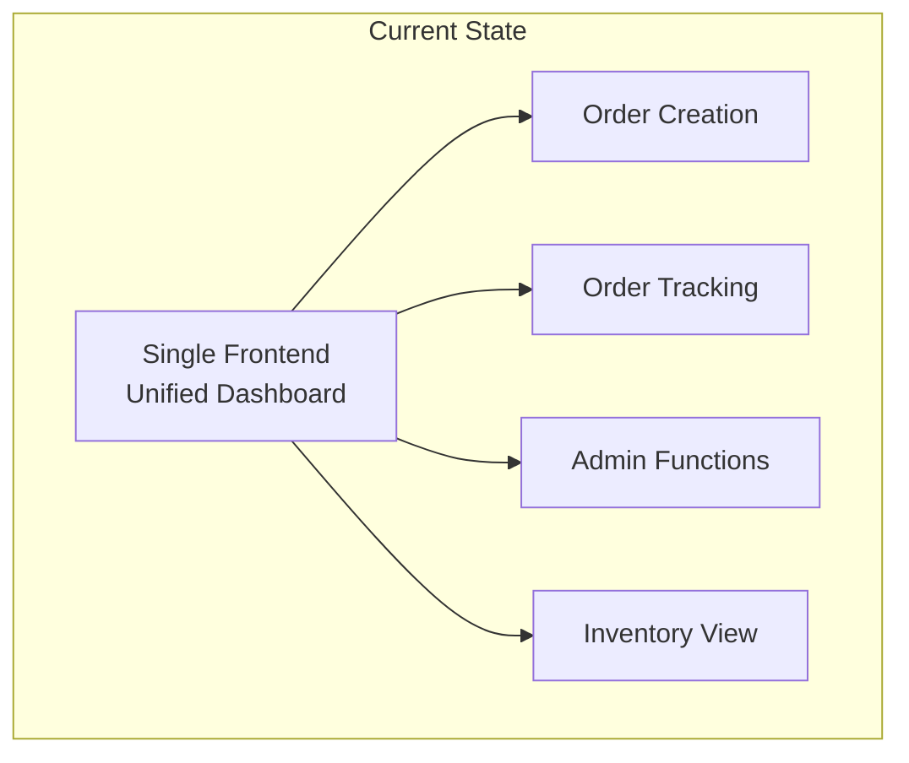
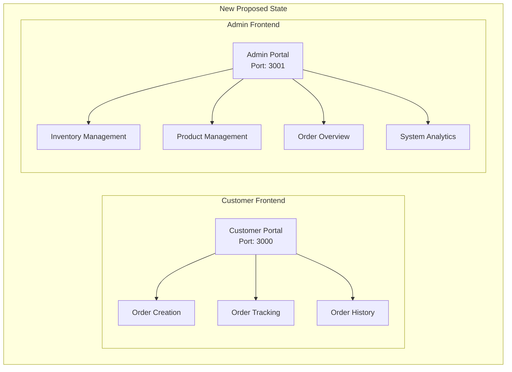
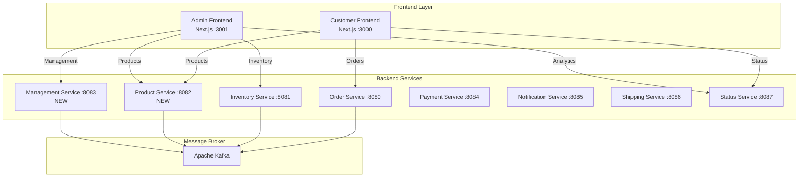
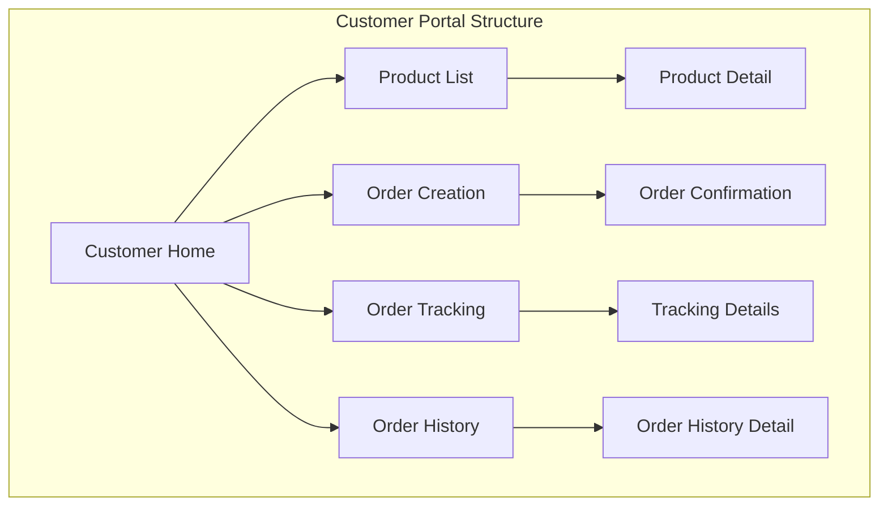
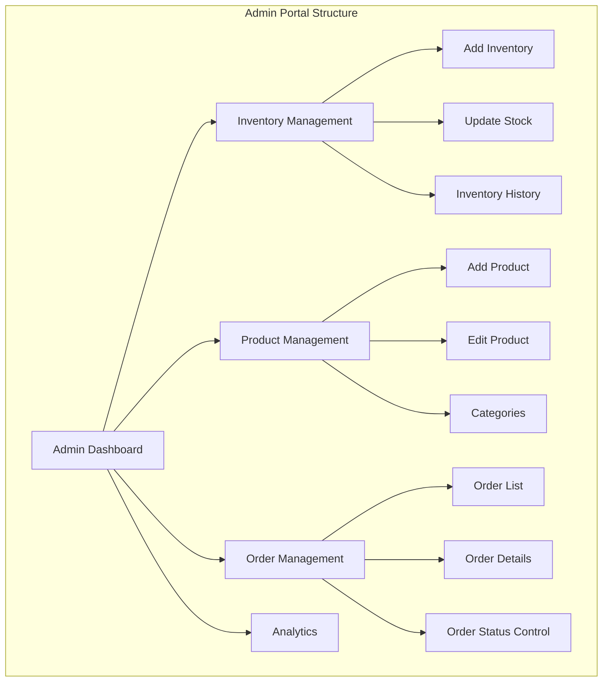
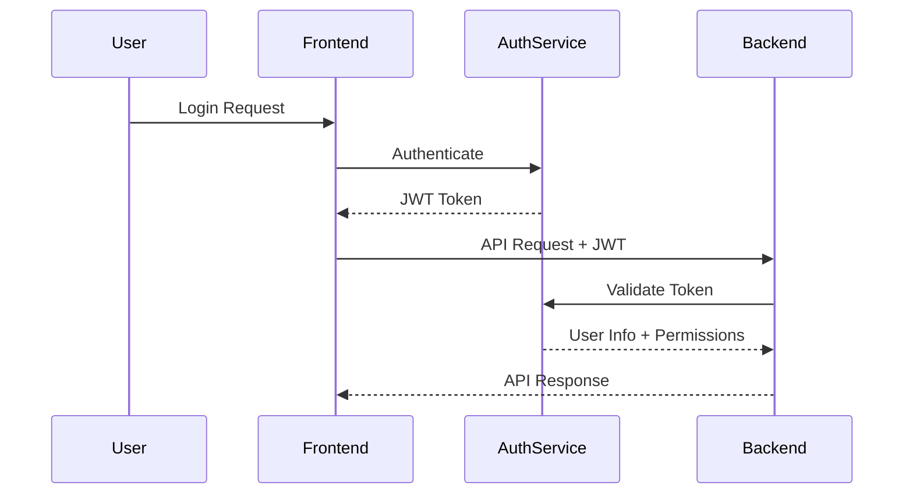

# 🎭 Frontend Separation Design Document

## 顧客・事業者画面分離仕様

---

## 📋 Table of Contents

- [1. 変更概要](#1-変更概要)
- [2. 新しいシステム構成](#2-新しいシステム構成)
- [3. フロントエンド設計](#3-フロントエンド設計)
- [4. バックエンド拡張](#4-バックエンド拡張)
- [5. データモデル変更](#5-データモデル変更)
- [6. API仕様](#6-api仕様)
- [7. 認証・認可設計](#7-認証認可設計)
- [8. 実装計画](#8-実装計画)

---

## 1. 変更概要

### 1.1 現在の状況



### 1.2 新しい構成



### 1.3 変更の目的

**顧客体験の向上**:
- シンプルで直感的な注文プロセス
- 注文状況の分かりやすい追跡
- 不要な管理機能の非表示

**事業者効率の向上**:  
- 在庫管理の効率化
- 商品管理機能の強化
- 運営分析ダッシュボード

**セキュリティの強化**:
- 権限に応じた機能分離
- 管理機能への適切なアクセス制御

---

## 2. 新しいシステム構成

### 2.1 全体アーキテクチャ



### 2.2 サービス役割の変更

| Service | Current Role | New Role | New Responsibilities |
|---------|-------------|----------|---------------------|
| **Order Service** | Order creation | Order creation | Same |
| **Inventory Service** | Stock management | Stock management | + Admin stock updates |
| **Product Service** | - | Product catalog | NEW: Product CRUD operations |
| **Management Service** | - | Admin operations | NEW: Admin analytics & controls |
| **Status Service** | Order tracking | Order tracking | + Enhanced analytics |

---

## 3. フロントエンド設計

### 3.1 顧客フロントエンド (Customer Portal)

#### 3.1.1 画面構成



#### 3.1.2 主要ページ仕様

**🏠 ホーム画面**
```typescript
interface CustomerHomeProps {
  recentOrders: Order[];
  featuredProducts: Product[];
  orderStats: {
    totalOrders: number;
    pendingOrders: number;
    completedOrders: number;
  };
}
```

**🛍️ 商品一覧画面**
```typescript
interface ProductListProps {
  products: Product[];
  categories: Category[];
  filters: ProductFilters;
  pagination: Pagination;
}

interface Product {
  id: string;
  name: string;
  description: string;
  price: number;
  availableStock: number;
  category: string;
  images: string[];
  isAvailable: boolean;
}
```

**📦 注文作成画面**
```typescript
interface OrderCreationProps {
  selectedProduct: Product;
  quantity: number;
  estimatedTotal: number;
  availableStock: number;
  deliveryOptions: DeliveryOption[];
}
```

**🔍 注文追跡画面**
```typescript
interface OrderTrackingProps {
  order: Order;
  realTimeStatus: boolean;
  estimatedDelivery: Date;
  trackingTimeline: TrackingEvent[];
}
```

#### 3.1.3 UI/UX特徴

**デザインコンセプト**: シンプル・直感的・モバイルフレンドリー

```yaml
design_principles:
  color_scheme:
    primary: "#3B82F6" # Blue
    secondary: "#10B981" # Green  
    accent: "#F59E0B" # Amber
    neutral: "#6B7280" # Gray
    
  typography:
    heading: "Inter Bold"
    body: "Inter Regular" 
    mono: "JetBrains Mono"
    
  components:
    buttons: "Rounded corners, clear CTA"
    cards: "Subtle shadows, clean borders"
    forms: "Minimal, real-time validation"
    
  responsive:
    mobile_first: true
    breakpoints: [640, 768, 1024, 1280]
```

### 3.2 事業者フロントエンド (Admin Portal)

#### 3.2.1 画面構成



#### 3.2.2 主要ページ仕様

**📊 管理ダッシュボード**
```typescript
interface AdminDashboardProps {
  metrics: {
    todayOrders: number;
    todayRevenue: number;
    lowStockProducts: number;
    pendingOrders: number;
  };
  charts: {
    orderTrends: ChartData;
    revenueTrends: ChartData;
    topProducts: ChartData;
  };
  alerts: SystemAlert[];
}
```

**📦 在庫管理画面**
```typescript
interface InventoryManagementProps {
  products: ProductWithStock[];
  lowStockAlerts: LowStockAlert[];
  stockHistory: StockMovement[];
  bulkOperations: BulkOperation[];
}

interface ProductWithStock extends Product {
  currentStock: number;
  reservedStock: number;
  availableStock: number;
  reorderLevel: number;
  lastRestocked: Date;
}

interface StockOperation {
  type: 'ADD' | 'REMOVE' | 'ADJUST';
  productId: string;
  quantity: number;
  reason: string;
  timestamp: Date;
}
```

**🏷️ 商品管理画面**
```typescript
interface ProductManagementProps {
  products: Product[];
  categories: Category[];
  productForm: ProductForm;
}

interface ProductForm {
  id?: string;
  name: string;
  description: string;
  price: number;
  category: string;
  initialStock: number;
  reorderLevel: number;
  images: File[];
  isActive: boolean;
}
```

**📋 注文管理画面**
```typescript
interface OrderManagementProps {
  orders: OrderWithDetails[];
  filters: OrderFilters;
  statusControls: OrderStatusControl[];
}

interface OrderWithDetails extends Order {
  customer: {
    id: string;
    name: string;
    email: string;
  };
  product: Product;
  paymentDetails: PaymentDetails;
  shippingDetails: ShippingDetails;
  adminNotes: AdminNote[];
}
```

#### 3.2.3 管理機能仕様

**在庫操作機能**:
```yaml
inventory_operations:
  add_stock:
    fields: [product_id, quantity, reason, supplier, cost]
    validation: "quantity > 0, reason required"
    event: "StockAdded"
    
  remove_stock:
    fields: [product_id, quantity, reason]
    validation: "quantity <= available_stock"
    event: "StockRemoved"
    
  adjust_stock:
    fields: [product_id, new_quantity, reason]
    validation: "new_quantity >= 0"
    event: "StockAdjusted"
    
  bulk_operations:
    import: "CSV file upload"
    export: "Stock report generation"
    alerts: "Low stock notifications"
```

**商品操作機能**:
```yaml
product_operations:
  create_product:
    fields: [name, description, price, category, initial_stock]
    validation: "All fields required, price > 0"
    event: "ProductCreated"
    
  update_product:
    fields: [any product field]
    validation: "Maintain referential integrity"
    event: "ProductUpdated"
    
  deactivate_product:
    action: "Set isActive = false"
    constraint: "No pending orders"
    event: "ProductDeactivated"
```

---

## 4. バックエンド拡張

### 4.1 新しいサービス

#### 4.1.1 Product Service (新規)

**責任範囲**:
- 商品カタログ管理
- カテゴリ管理
- 商品情報のCRUD操作
- 商品検索・フィルタリング

**API エンドポイント**:
```yaml
endpoints:
  # 商品管理
  GET /products              # 商品一覧取得
  GET /products/{id}         # 商品詳細取得  
  POST /products             # 商品作成
  PUT /products/{id}         # 商品更新
  DELETE /products/{id}      # 商品削除
  
  # カテゴリ管理
  GET /categories            # カテゴリ一覧
  POST /categories           # カテゴリ作成
  PUT /categories/{id}       # カテゴリ更新
  
  # 検索・フィルタ
  GET /products/search?q={query}
  GET /products/filter?category={cat}&price_min={min}
```

**データモデル**:
```go
type Product struct {
    ID          string    `json:"id"`
    Name        string    `json:"name"`
    Description string    `json:"description"`
    Price       float64   `json:"price"`
    Category    string    `json:"category"`
    Images      []string  `json:"images"`
    IsActive    bool      `json:"is_active"`
    CreatedAt   time.Time `json:"created_at"`
    UpdatedAt   time.Time `json:"updated_at"`
}

type Category struct {
    ID          string    `json:"id"`
    Name        string    `json:"name"`
    Description string    `json:"description"`
    IsActive    bool      `json:"is_active"`
}
```

#### 4.1.2 Management Service (新規)

**責任範囲**:
- 管理者向け分析データ
- システム設定管理
- 管理者操作ログ
- レポート生成

**API エンドポイント**:
```yaml
endpoints:
  # ダッシュボード
  GET /dashboard/metrics     # 主要メトリクス
  GET /dashboard/charts      # チャートデータ
  
  # 分析
  GET /analytics/orders      # 注文分析
  GET /analytics/products    # 商品分析  
  GET /analytics/revenue     # 売上分析
  
  # レポート
  POST /reports/generate     # レポート生成
  GET /reports/{id}          # レポート取得
  
  # システム管理
  GET /system/health         # システム状態
  POST /system/alerts        # アラート設定
```

### 4.2 既存サービスの拡張

#### 4.2.1 Inventory Service 拡張

**新機能追加**:
```yaml
new_endpoints:
  # 管理者向け在庫操作
  POST /admin/inventory/add     # 在庫追加
  POST /admin/inventory/remove  # 在庫削除  
  POST /admin/inventory/adjust  # 在庫調整
  
  # 在庫履歴・分析
  GET /admin/inventory/history  # 在庫変動履歴
  GET /admin/inventory/alerts   # 低在庫アラート
  POST /admin/inventory/bulk    # 一括操作

new_events:
  - StockAdded: "管理者による在庫追加"
  - StockRemoved: "管理者による在庫削除"
  - StockAdjusted: "在庫調整"
  - LowStockAlert: "低在庫アラート"
```

**拡張データモデル**:
```go
type StockMovement struct {
    ID          string    `json:"id"`
    ProductID   string    `json:"product_id"`
    Type        string    `json:"type"` // ADD, REMOVE, ADJUST, RESERVE, RELEASE
    Quantity    int       `json:"quantity"`
    PreviousQty int       `json:"previous_qty"`
    NewQty      int       `json:"new_qty"`
    Reason      string    `json:"reason"`
    AdminID     string    `json:"admin_id,omitempty"`
    Timestamp   time.Time `json:"timestamp"`
}

type StockAlert struct {
    ProductID     string    `json:"product_id"`
    ProductName   string    `json:"product_name"`
    CurrentStock  int       `json:"current_stock"`
    ReorderLevel  int       `json:"reorder_level"`
    AlertLevel    string    `json:"alert_level"` // LOW, CRITICAL, OUT_OF_STOCK
    CreatedAt     time.Time `json:"created_at"`
}
```

#### 4.2.2 Status Service 拡張

**管理者向け機能追加**:
```yaml
admin_endpoints:
  GET /admin/orders              # 全注文一覧（管理者向け）
  GET /admin/orders/{id}         # 注文詳細（管理者向け）
  PUT /admin/orders/{id}/status  # 注文状態手動更新
  POST /admin/orders/{id}/notes  # 管理者メモ追加
  
  GET /admin/analytics/real-time # リアルタイム分析
  GET /admin/system/status       # システム状態監視
```

---

## 5. データモデル変更

### 5.1 新しいエンティティ

```go
// 商品カテゴリ
type Category struct {
    ID          string    `json:"id"`
    Name        string    `json:"name"`
    Description string    `json:"description"`
    ParentID    *string   `json:"parent_id,omitempty"`
    IsActive    bool      `json:"is_active"`
    CreatedAt   time.Time `json:"created_at"`
    UpdatedAt   time.Time `json:"updated_at"`
}

// 管理者ユーザー  
type AdminUser struct {
    ID        string    `json:"id"`
    Username  string    `json:"username"`
    Email     string    `json:"email"`
    Role      string    `json:"role"`
    IsActive  bool      `json:"is_active"`
    CreatedAt time.Time `json:"created_at"`
}

// 管理者操作ログ
type AdminLog struct {
    ID        string                 `json:"id"`
    AdminID   string                 `json:"admin_id"`
    Action    string                 `json:"action"`
    Resource  string                 `json:"resource"`
    Details   map[string]interface{} `json:"details"`
    IPAddress string                 `json:"ip_address"`
    Timestamp time.Time              `json:"timestamp"`
}

// システムメトリクス
type SystemMetrics struct {
    Timestamp       time.Time `json:"timestamp"`
    TotalOrders     int       `json:"total_orders"`
    TodayOrders     int       `json:"today_orders"`
    TotalRevenue    float64   `json:"total_revenue"`
    TodayRevenue    float64   `json:"today_revenue"`
    ActiveProducts  int       `json:"active_products"`
    LowStockCount   int       `json:"low_stock_count"`
    PendingOrders   int       `json:"pending_orders"`
    CompletedOrders int       `json:"completed_orders"`
}
```

### 5.2 既存エンティティの拡張

```go
// Product エンティティの拡張
type Product struct {
    ID           string    `json:"id"`
    Name         string    `json:"name"`
    Description  string    `json:"description"`
    Price        float64   `json:"price"`
    CategoryID   string    `json:"category_id"`    // NEW
    Images       []string  `json:"images"`         // NEW
    IsActive     bool      `json:"is_active"`      // NEW
    ReorderLevel int       `json:"reorder_level"`  // NEW
    CreatedAt    time.Time `json:"created_at"`
    UpdatedAt    time.Time `json:"updated_at"`
}

// Order エンティティの拡張  
type Order struct {
    // 既存フィールド
    OrderID       string        `json:"order_id"`
    ProductID     string        `json:"product_id"`
    Quantity      int           `json:"quantity"`
    Status        OrderStatus   `json:"status"`
    Events        []EventRecord `json:"events"`
    LastUpdated   time.Time     `json:"last_updated"`
    TrackingNumber string       `json:"tracking_number,omitempty"`
    PaymentAmount  float64      `json:"payment_amount,omitempty"`
    
    // 新規フィールド
    CustomerID    string      `json:"customer_id"`     // NEW
    AdminNotes    []AdminNote `json:"admin_notes"`     // NEW
    Priority      string      `json:"priority"`        // NEW
    CreatedAt     time.Time   `json:"created_at"`
    UpdatedAt     time.Time   `json:"updated_at"`
}

// 管理者メモ
type AdminNote struct {
    ID        string    `json:"id"`
    AdminID   string    `json:"admin_id"`
    Content   string    `json:"content"`
    CreatedAt time.Time `json:"created_at"`
}
```

---

## 6. API仕様

### 6.1 顧客向けAPI

#### 6.1.1 商品関連API

```yaml
# 商品一覧取得
GET /api/products:
  parameters:
    - name: category
      type: string
      description: カテゴリフィルター
    - name: search
      type: string  
      description: 検索クエリ
    - name: page
      type: integer
      description: ページ番号
    - name: limit
      type: integer
      description: 1ページあたりの件数
  responses:
    200:
      products: Product[]
      pagination: PaginationInfo
      categories: Category[]

# 商品詳細取得      
GET /api/products/{productId}:
  responses:
    200:
      product: Product
      availableStock: number
      relatedProducts: Product[]
    404:
      error: "Product not found"
```

#### 6.1.2 注文関連API

```yaml
# 注文作成
POST /api/orders:
  requestBody:
    productId: string
    quantity: number
    customerInfo?: CustomerInfo
  responses:
    201:
      orderId: string
      estimatedTotal: number
      estimatedDelivery: string
    400:
      error: "Validation error"
    409:
      error: "Insufficient stock"

# 注文履歴取得
GET /api/orders/history:
  parameters:
    - name: customerId
      type: string
      description: 顧客ID
    - name: status
      type: string
      description: ステータスフィルター
  responses:
    200:
      orders: Order[]
      summary: OrderSummary
```

### 6.2 管理者向けAPI

#### 6.2.1 在庫管理API

```yaml
# 在庫追加
POST /api/admin/inventory/add:
  requestBody:
    productId: string
    quantity: number
    reason: string
    cost?: number
    supplier?: string
  responses:
    201:
      message: "Stock added successfully"
      newStock: number
      movement: StockMovement

# 在庫一括更新
POST /api/admin/inventory/bulk-update:
  requestBody:
    operations: BulkStockOperation[]
  responses:
    200:
      successful: number
      failed: number
      errors: BulkOperationError[]
```

#### 6.2.2 商品管理API

```yaml
# 商品作成
POST /api/admin/products:
  requestBody:
    name: string
    description: string
    price: number
    categoryId: string
    initialStock: number
    reorderLevel: number
    images: File[]
  responses:
    201:
      product: Product
      message: "Product created successfully"

# 商品更新
PUT /api/admin/products/{productId}:
  requestBody:
    # Any product fields to update
  responses:
    200:
      product: Product
      message: "Product updated successfully"
```

#### 6.2.3 分析・レポートAPI

```yaml
# ダッシュボードメトリクス
GET /api/admin/dashboard/metrics:
  parameters:
    - name: period
      type: string
      enum: [today, week, month, year]
  responses:
    200:
      metrics: DashboardMetrics
      trends: TrendData

# 売上分析
GET /api/admin/analytics/revenue:
  parameters:
    - name: startDate
      type: string
      format: date
    - name: endDate  
      type: string
      format: date
    - name: groupBy
      type: string
      enum: [day, week, month]
  responses:
    200:
      data: RevenueAnalytics[]
      summary: RevenueSummary
```

---

## 7. 認証・認可設計

### 7.1 認証方式



### 7.2 権限設計

```yaml
roles:
  customer:
    permissions:
      - "orders:create"
      - "orders:read:own"
      - "products:read"
      
  admin:
    permissions:
      - "products:*"
      - "inventory:*"
      - "orders:*"
      - "analytics:read"
      - "system:read"
      
  super_admin:
    permissions:
      - "*:*"
      
endpoints_protection:
  # 顧客エンドポイント
  "/api/orders":
    POST: ["customer", "admin"]
    GET: ["customer:own", "admin:all"]
    
  # 管理者エンドポイント  
  "/api/admin/*":
    "*": ["admin", "super_admin"]
    
  # 商品エンドポイント
  "/api/products":
    GET: ["public"]
    POST: ["admin"]
    PUT: ["admin"] 
    DELETE: ["admin"]
```

### 7.3 JWT トークン設計

```typescript
interface JWTPayload {
  sub: string;        // User ID
  role: string;       // User role
  permissions: string[]; // Specific permissions
  iss: string;        // Issuer
  exp: number;        // Expiration time
  iat: number;        // Issued at
}

interface UserSession {
  userId: string;
  role: 'customer' | 'admin' | 'super_admin';
  permissions: string[];
  loginTime: Date;
  lastActivity: Date;
}
```

---

## 8. 実装計画

### 8.1 フェーズ1: 基盤準備 (Week 1-2)

**バックエンド**:
```yaml
week_1:
  - Product Service 基本実装
  - Management Service 基本実装  
  - 既存サービスのポート番号変更
  - 基本的なCRUD API実装

week_2:  
  - Inventory Service 拡張
  - Status Service 管理者機能追加
  - 新しいイベント型の定義・実装
  - Docker Compose 設定更新
```

**フロントエンド**:
```yaml
week_1:
  - プロジェクト構造の分離
  - Customer Portal 基本構造
  - Admin Portal 基本構造
  - 共通コンポーネントライブラリ

week_2:
  - 顧客向け商品一覧画面
  - 顧客向け注文作成画面
  - 管理者ダッシュボード基本形
  - 認証機能の基盤実装
```

### 8.2 フェーズ2: 顧客機能実装 (Week 3-4)

```yaml
customer_features:
  week_3:
    - 商品検索・フィルタリング
    - 注文作成フロー完成
    - 注文履歴表示
    - 注文詳細・追跡画面

  week_4:
    - リアルタイム注文追跡
    - レスポンシブデザイン最適化
    - エラーハンドリング強化
    - UXテスト・改善
```

### 8.3 フェーズ3: 管理者機能実装 (Week 5-6)

```yaml
admin_features:
  week_5:
    - 在庫管理機能完成
    - 商品管理機能完成
    - 一括操作機能
    - 在庫アラート機能

  week_6:
    - 注文管理機能
    - 分析・レポート機能
    - システム監視機能
    - 管理者ログ機能
```

### 8.4 フェーズ4: 統合・最適化 (Week 7-8)

```yaml
integration_testing:
  week_7:
    - 統合テスト実施
    - パフォーマンス最適化
    - セキュリティ強化
    - バグ修正

  week_8:
    - 本番デプロイ準備
    - ドキュメント更新
    - 運用手順作成
    - 最終テスト・検証
```

### 8.5 ディレクトリ構造

```
project/
├── frontend/
│   ├── customer/          # 顧客向けフロントエンド
│   │   ├── src/
│   │   │   ├── app/
│   │   │   ├── components/
│   │   │   ├── lib/
│   │   │   └── types/
│   │   ├── package.json
│   │   └── Dockerfile
│   │
│   ├── admin/             # 管理者向けフロントエンド  
│   │   ├── src/
│   │   │   ├── app/
│   │   │   ├── components/
│   │   │   ├── lib/
│   │   │   └── types/
│   │   ├── package.json
│   │   └── Dockerfile
│   │
│   └── shared/            # 共通コンポーネント
│       ├── components/
│       ├── types/
│       ├── utils/
│       └── package.json
│
├── services/
│   ├── order-service/    
│   ├── inventory-service/
│   ├── product-service/   # 新規
│   ├── management-service/ # 新規
│   ├── payment-service/
│   ├── notification-service/
│   ├── shipping-service/
│   └── status-service/
│
├── docker-compose.yml
├── docker-compose.admin.yml
└── Makefile
```

### 8.6 Docker Compose 更新

```yaml
# docker-compose.yml (更新版)
services:
  # Frontend Services
  customer-frontend:
    build: ./frontend/customer
    ports: ["3000:3000"]
    depends_on: [order-service, product-service, status-service]
    
  admin-frontend:
    build: ./frontend/admin  
    ports: ["3001:3001"]
    depends_on: [management-service, inventory-service, product-service]
  
  # New Backend Services
  product-service:
    build: ./services/product-service
    ports: ["8082:8082"]
    depends_on: [kafka]
    
  management-service:
    build: ./services/management-service
    ports: ["8083:8083"] 
    depends_on: [kafka]
  
  # Updated existing services with new ports
  payment-service:
    ports: ["8084:8084"]  # Changed from 8082
    
  notification-service:
    ports: ["8085:8085"]  # Changed from 8083
    
  shipping-service: 
    ports: ["8086:8086"]  # Changed from 8084
    
  status-service:
    ports: ["8087:8087"]  # Changed from 8085
```

### 8.7 Makefile コマンド拡張

```makefile
# 新しいコマンド
run-customer:      ## 顧客向けサービスのみ起動
run-admin:         ## 管理者向けサービスのみ起動  
build-frontends:   ## 両方のフロントエンドをビルド
test-customer:     ## 顧客向け機能のテスト
test-admin:        ## 管理者向け機能のテスト

# URL shortcuts
open-customer:     ## 顧客画面を開く (http://localhost:3000)
open-admin:        ## 管理者画面を開く (http://localhost:3001)
```

---

## 9. 期待される成果

### 9.1 顧客体験の向上

```yaml
improvements:
  usability:
    - "不要な管理機能の非表示"
    - "直感的な注文フロー"  
    - "分かりやすい商品表示"
    
  performance:
    - "必要な機能のみ読み込み"
    - "モバイル最適化"
    - "高速な商品検索"
    
  satisfaction:
    - "シンプルなUI/UX"
    - "リアルタイム追跡"
    - "信頼性の高い注文プロセス"
```

### 9.2 事業者効率の向上

```yaml
admin_benefits:
  inventory_management:
    - "リアルタイム在庫監視"
    - "自動低在庫アラート"
    - "一括操作による効率化"
    
  business_intelligence:
    - "売上分析ダッシュボード"
    - "商品パフォーマンス分析"
    - "注文トレンド把握"
    
  operational_efficiency:
    - "注文管理の効率化"
    - "商品管理の簡素化"
    - "システム状態の可視化"
```

### 9.3 システムアーキテクチャの改善

```yaml
technical_improvements:
  separation_of_concerns:
    - "役割に応じた機能分離"
    - "セキュリティの強化"
    - "保守性の向上"
    
  scalability:
    - "独立したフロントエンドスケーリング"
    - "適切な負荷分散"
    - "リソース最適化"
    
  maintainability:
    - "コードベースの明確な分離"
    - "独立したデプロイ"
    - "テストの効率化"
```

---

## 📋 まとめ

この仕様変更により、現在の統一フロントエンドから **顧客向け** と **管理者向け** の2つの専用フロントエンドに分離します。これにより、それぞれのユーザーに最適化された体験を提供し、システム全体の効率性とセキュリティを向上させます。

**主な変更ポイント**:
- ✅ **フロントエンド分離**: 顧客用(3000)・管理者用(3001)
- ✅ **新サービス追加**: Product Service・Management Service  
- ✅ **管理機能強化**: 在庫管理・商品管理・分析機能
- ✅ **UX最適化**: 役割に応じた最適なインターフェース
- ✅ **セキュリティ強化**: 適切な権限分離

**実装期間**: 約8週間（2ヶ月）で段階的に実装し、既存システムへの影響を最小化しながら新機能を導入します。

---

**📝 Document Version**: 1.0.0  
**📅 Created**: August 20, 2025  
**👨‍💻 Author**: Event-Driven Systems Design Team