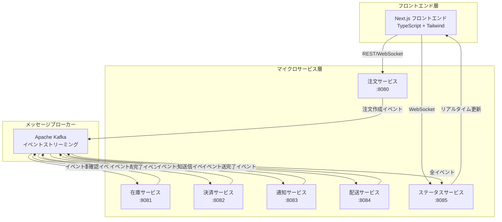
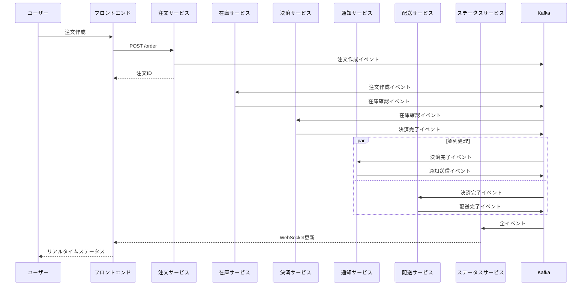

# 🚀 イベント駆動型ECマイクロサービス

[](https://golang.org/)
[](https://nextjs.org/)
[](https://kafka.apache.org/)
[](https://docker.com/)
[](https://kubernetes.io/)

**リアルタイムWebSocket更新機能を備えた、モダンなイベント駆動型マイクロサービスアーキテクチャによるEコマース注文処理システム**

## 🎯 プロジェクト概要

このプロジェクトは、高スケールなEコマース注文処理のための**完全なイベント駆動型マイクロサービスシステム**を実証します。イベントソーシング、CQRS、WebSocketによるリアルタイム通信などのモダンアーキテクチャパターンを採用しています。

### ✨ 主要機能

- 🔄 **イベント駆動アーキテクチャ** - 全サービスがKafkaイベントで通信
- ⚡ **リアルタイム更新** - WebSocketによるライブ注文追跡
- 🏗️ **マイクロサービス** - 独立した疎結合サービス
- 📱 **モダンUI** - React/Next.js + Tailwind CSS + TypeScript
- 🐳 **コンテナネイティブ** - Docker & Kubernetes完全対応
- ☁️ **クラウド対応** - AWS EKSデプロイメント対応
- 🔍 **可観測性** - ヘルスチェックとモニタリング対応
- 🧪 **テストカバレッジ** - 包括的テスト戦略

## 🏛️ システム構成



## 🚦 クイックスタート

### 前提条件

- Docker & Docker Compose
- （オプション）ローカル開発用 Go 1.21+
- （オプション）フロントエンド開発用 Node.js 18+

### 🎬 ワンコマンドセットアップ

```bash
# リポジトリのクローンとシステム全体の起動
git clone <repository-url>
cd kubernetes-event-driven-service

# 全サービス起動（バックエンド + フロントエンド）
make run-local

# ブラウザでフロントエンドを開く
make open-frontend
```

これで完了！システムは以下のURLで利用可能になります：
- **フロントエンド**: http://localhost:3000
- **注文API**: http://localhost:8080
- **ステータスAPI**: http://localhost:8085

### 🧪 システムのテスト

```bash
# テスト注文の作成
make test-order

# 在庫レベルの確認
make test-inventory

# 注文ステータスの確認
make test-status
```

## 🛠️ 開発環境セットアップ

### ローカル開発

```bash
# バックエンドサービスのみ起動
docker-compose up -d zookeeper kafka order-service inventory-service payment-service notification-service shipping-service status-service

# フロントエンドを開発モードで起動
cd frontend
npm install
npm run dev
```

### 利用可能サービス

| サービス | ポート | 用途 | ヘルスチェック |
|---------|------|------|--------------|
| **フロントエンド** | 3000 | React/Next.js UI | <http://localhost:3000> |
| **注文サービス** | 8080 | 注文作成 | <http://localhost:8080/health> |
| **在庫サービス** | 8081 | 在庫管理 | <http://localhost:8081/health> |
| **決済サービス** | 8082 | 決済処理 | <http://localhost:8082/health> |
| **通知サービス** | 8083 | 顧客通知 | <http://localhost:8083/health> |
| **配送サービス** | 8084 | 配送・追跡 | <http://localhost:8084/health> |
| **ステータスサービス** | 8085 | 注文追跡 + WebSocket | <http://localhost:8085/health> |
| **Kafka** | 9092 | メッセージブローカー | - |
| **Zookeeper** | 2181 | Kafka調整 | - |

## 📊 イベントフロー

システムはイベント駆動ワークフローで注文を処理します：



## 🎮 インタラクティブデモ

### 1. **ダッシュボード表示**

- リアルタイム注文統計
- 在庫レベル監視
- 全注文の現在ステータス表示

### 2. **注文作成**

- 商品選択（プレミアムウィジェット、デラックスガジェット、エリートデバイス）
- 数量選択（在庫検証付き）
- リアルタイム価格計算

### 3. **リアルタイム追跡**

- 注文の進行状況をリアルタイム監視
- タイムスタンプ付きイベントタイムライン
- 配送追跡番号取得
- WebSocket接続状態インジケーター

### 4. **イベントタイムライン**

各注文の完全なイベント履歴を表示：

- ✅ **注文作成** → ✅ **在庫確認** → ✅ **決済完了** → ✅ **通知送信** → ✅ **配送完了**

## 🏗️ アーキテクチャのハイライト

### マイクロサービスパターン

- **単一責任原則**: 各サービスは集中したビジネス機能を持つ
- **サービス毎のデータベース**: 独立したデータ管理（現在はインメモリ）
- **分散化**: 中央オーケストレーターなし、純粋なイベント駆動調整

### イベントソーシング

- **イベントストア**: Kafkaがシステムのメモリとして機能
- **イベント再生**: イベントから状態を再構築する能力
- **監査証跡**: すべてのビジネスイベントの完全な履歴

### CQRS（コマンドクエリ責任分離）

- **コマンド**: 書き込み操作（注文作成、在庫予約）
- **クエリ**: 読み込み操作（注文ステータス、在庫レベル）
- **分離モデル**: 異なるアクセスパターンに最適化

### リアルタイム通信

- **WebSocket**: 双方向リアルタイム更新
- **Server-Sent Events**: ステータス更新の代替手段
- **接続管理**: 自動再接続とエラーハンドリング

## 🚀 デプロイメント方法

### 📦 オプション1: Docker Compose（ローカル/開発環境）

#### ステップ1: リポジトリのクローン

```bash
git clone https://github.com/your-org/kubernetes-event-driven-service.git
cd kubernetes-event-driven-service
```

#### ステップ2: 全サービスの起動

```bash
# 全サービス（バックエンド + フロントエンド）を起動
make run-local

# または直接Docker Composeを使用
docker-compose up -d
```

#### ステップ3: サービスの確認

```bash
# 全サービスのヘルスチェック
make health-check

# ログの確認
make logs-local

# フロントエンドをブラウザで開く
make open-frontend
```

#### 特定サービスのみ起動

```bash
# バックエンドサービスのみ
docker-compose up -d zookeeper kafka order-service inventory-service payment-service notification-service shipping-service status-service

# フロントエンドのみ（開発モード）
cd frontend/customer  # または frontend/admin
npm install
npm run dev
```

#### フロントエンドの個別起動

```bash
# 顧客用フロントエンド (ポート3000)
cd frontend/customer
npm install
npm run dev

# 管理者用フロントエンド (ポート3001)
cd frontend/admin
npm install
npm run dev
```

#### 停止とクリーンアップ

```bash
# 全サービス停止
make stop-local

# または
docker-compose down

# ボリュームも含めて完全削除
docker-compose down -v
```

### ☸️ オプション2: Kubernetes（本番環境）

#### Kubernetes環境の前提条件

```bash
# kubectl のインストール確認
kubectl version --client

# クラスターへの接続確認
kubectl cluster-info
```

#### ステップ1: Kafka（Strimzi）のデプロイ

```bash
# Strimzi Operatorのインストール
kubectl apply -f deploy/k8s/kafka/strimzi-operator.yaml

# Operatorの起動を待機
kubectl wait deployment/strimzi-cluster-operator --for=condition=Available --timeout=300s -n kafka

# Kafkaクラスターのデプロイ
kubectl apply -f deploy/k8s/kafka/kafka-cluster.yaml

# Kafkaクラスターの準備完了を確認
kubectl wait kafka/my-cluster --for=condition=Ready --timeout=300s -n kafka
```

#### ステップ2: マイクロサービスのデプロイ

```bash
# Dockerイメージのビルド
make build-k8s

# 全マイクロサービスのデプロイ
kubectl apply -f deploy/k8s/order-service/deployment.yaml
kubectl apply -f deploy/k8s/inventory-service/deployment.yaml
kubectl apply -f deploy/k8s/payment-service/deployment.yaml
kubectl apply -f deploy/k8s/notification-service/deployment.yaml
kubectl apply -f deploy/k8s/shipping-service/deployment.yaml
kubectl apply -f deploy/k8s/status-service/deployment.yaml

# または一括デプロイ
./deploy/k8s/deploy-all.sh
```

#### Kubernetesサービスの確認

```bash
# Pod状態の確認
kubectl get pods

# サービス状態の確認
kubectl get services

# ログの確認
kubectl logs -l app=order-service

# ポートフォワードでローカルアクセス
kubectl port-forward service/status-service 8085:8085
```

#### スケーリング

```bash
# レプリカ数の増加
kubectl scale deployment order-service --replicas=3
kubectl scale deployment inventory-service --replicas=2

# オートスケーリングの設定
kubectl autoscale deployment order-service --cpu-percent=70 --min=2 --max=10
```

#### アップデート

```bash
# ローリングアップデート
kubectl set image deployment/order-service order-service=your-registry/order-service:v2.0

# アップデート状況の確認
kubectl rollout status deployment/order-service

# ロールバック（必要に応じて）
kubectl rollout undo deployment/order-service
```

### ☁️ オプション3: AWS EKS（クラウド本番環境）

#### AWS EKSの前提条件

```bash
# AWS CLI のインストールと設定
aws configure

# eksctl のインストール
curl --silent --location "https://github.com/weaveworks/eksctl/releases/latest/download/eksctl_$(uname -s)_amd64.tar.gz" | tar xz -C /tmp
sudo mv /tmp/eksctl /usr/local/bin
```

#### ステップ1: EKSクラスターの作成

```bash
# クラスター設定ファイルの作成
cat > cluster-config.yaml << EOF
apiVersion: eksctl.io/v1alpha5
kind: ClusterConfig

metadata:
  name: ecommerce-cluster
  region: us-west-2

nodeGroups:
  - name: worker-nodes
    instanceType: t3.medium
    desiredCapacity: 3
    minSize: 1
    maxSize: 5
    volumeSize: 20
    ssh:
      allow: true
EOF

# クラスターの作成
eksctl create cluster -f cluster-config.yaml
```

#### ステップ2: ECRリポジトリの作成とイメージプッシュ

```bash
# ECRリポジトリの作成
aws ecr create-repository --repository-name order-service
aws ecr create-repository --repository-name inventory-service
aws ecr create-repository --repository-name payment-service
aws ecr create-repository --repository-name notification-service
aws ecr create-repository --repository-name shipping-service
aws ecr create-repository --repository-name status-service

# ECRログイン
aws ecr get-login-password --region us-west-2 | docker login --username AWS --password-stdin <account-id>.dkr.ecr.us-west-2.amazonaws.com

# イメージのビルドとプッシュ
./scripts/build-and-push-ecr.sh
```

#### ステップ3: EKSへのデプロイ

```bash
# kubectl設定の更新
aws eks update-kubeconfig --region us-west-2 --name ecommerce-cluster

# Strimzi Operatorのインストール
kubectl apply -f deploy/k8s/kafka/strimzi-operator.yaml

# サービスのデプロイ（ECRイメージを使用）
envsubst < deploy/k8s/order-service/deployment.yaml | kubectl apply -f -

# Load Balancerの設定
kubectl apply -f deploy/k8s/ingress/
```

#### ステップ4: モニタリングの設定

```bash
# Prometheus と Grafana のインストール
helm repo add prometheus-community https://prometheus-community.github.io/helm-charts
helm repo update

helm install prometheus prometheus-community/kube-prometheus-stack

# ダッシュボードへのアクセス
kubectl port-forward service/prometheus-grafana 3000:80
```

### 🛠️ 環境固有の設定

#### 開発環境

```bash
# 開発用環境変数
export KAFKA_BROKER=localhost:9092
export LOG_LEVEL=debug
export ENABLE_CORS=true
```

#### ステージング環境

```bash
# ステージング用環境変数
export KAFKA_BROKER=kafka.staging.svc.cluster.local:9092
export LOG_LEVEL=info
export ENABLE_METRICS=true
```

#### 本番環境

```bash
# 本番用環境変数
export KAFKA_BROKER=kafka.production.svc.cluster.local:9092
export LOG_LEVEL=warn
export ENABLE_METRICS=true
export ENABLE_DISTRIBUTED_TRACING=true
```

### 🔍 デプロイメント後のヘルスチェック

#### 全サービスのヘルス確認

```bash
# 全サービスのヘルス確認
curl http://localhost:8080/health  # Order Service
curl http://localhost:8081/health  # Inventory Service
curl http://localhost:8082/health  # Payment Service
curl http://localhost:8083/health  # Notification Service
curl http://localhost:8084/health  # Shipping Service
curl http://localhost:8085/health  # Status Service

# Kubernetes環境での確認
kubectl get pods -l app=order-service
kubectl logs -l app=order-service --tail=50
```

#### 統合テスト

```bash
# テスト注文の作成
make test-order

# エンドツーエンドテスト
make test-e2e

# パフォーマンステスト
make test-performance
```

### 🚨 トラブルシューティング

#### よくある問題と解決方法

1. **Kafkaに接続できない**

   ```bash
   # Kafka Podの状態確認
   kubectl get pods -n kafka
   kubectl logs -n kafka my-cluster-kafka-0
   ```

2. **サービスが起動しない**

   ```bash
   # Pod状態の詳細確認
   kubectl describe pod <pod-name>
   kubectl logs <pod-name> --previous
   ```

3. **フロントエンドからAPIに接続できない**

   ```bash
   # サービス設定の確認
   kubectl get services
   kubectl port-forward service/status-service 8085:8085
   ```

#### ログ収集

```bash
# 全サービスのログを収集
kubectl logs -l app=order-service > order-service.log
kubectl logs -l app=inventory-service > inventory-service.log
# ...など

# 集約されたログの確認
kubectl logs -f deployment/order-service
```

## 🌐 フロントエンドデプロイメント

プロジェクトには2つのNext.jsフロントエンドアプリケーションがあります：

- **顧客用ポータル** (`frontend/customer`) - ポート3000
- **管理者用ポータル** (`frontend/admin`) - ポート3001

### 📦 オプション1: Vercel デプロイメント（推奨）

#### 顧客用ポータルのVercelデプロイ

1. **プロジェクトの準備**

   ```bash
   cd frontend/customer
   
   # 依存関係のインストール
   npm install
   
   # ビルドテスト
   npm run build
   ```

2. **Vercelプロジェクトの作成**

   ```bash
   # Vercel CLIのインストール
   npm install -g vercel
   
   # Vercelにログイン
   vercel login
   
   # プロジェクトの初期化
   vercel
   ```

3. **環境変数の設定**

   Vercelダッシュボードまたはコマンドラインで設定：

   ```bash
   # 本番環境
   vercel env add NEXT_PUBLIC_API_BASE_URL production
   # 値: https://your-api-domain.com
   
   vercel env add NEXT_PUBLIC_WS_URL production
   # 値: wss://your-websocket-domain.com
   
   # プレビュー環境
   vercel env add NEXT_PUBLIC_API_BASE_URL preview
   # 値: https://staging-api-domain.com
   ```

4. **カスタムドメインの設定（オプション）**

   ```bash
   # カスタムドメインの追加
   vercel domains add customer.your-domain.com
   vercel alias set your-vercel-app.vercel.app customer.your-domain.com
   ```

#### 管理者用ポータルのVercelデプロイ

```bash
cd frontend/admin

# 同様の手順でデプロイ
vercel

# カスタムドメイン（オプション）
vercel domains add admin.your-domain.com
```

#### 自動デプロイメントの設定

`vercel.json` を各フロントエンドディレクトリに作成：

```json
{
  "version": 2,
  "name": "ecommerce-customer-portal",
  "builds": [
    {
      "src": "package.json",
      "use": "@vercel/next"
    }
  ],
  "routes": [
    {
      "src": "/(.*)",
      "dest": "/$1"
    }
  ],
  "env": {
    "NEXT_PUBLIC_API_BASE_URL": "@api-base-url",
    "NEXT_PUBLIC_WS_URL": "@websocket-url"
  }
}
```

#### GitHub連携による自動デプロイ

1. **GitHubリポジトリの連携**

   ```bash
   # Vercelダッシュボードで以下を設定：
   # 1. GitHubリポジトリを連携
   # 2. Root Directory を "frontend/customer" に設定
   # 3. Build Command を "npm run build" に設定
   # 4. Output Directory を ".next" に設定
   ```

2. **プルリクエスト用プレビュー**

   - mainブランチ → 本番デプロイ
   - feature/* ブランチ → プレビューデプロイ

### 📦 オプション2: Docker + Cloud Run デプロイメント

#### Dockerイメージのビルドとデプロイ

```bash
# 顧客用フロントエンドのビルド
cd frontend/customer
docker build -t gcr.io/your-project/customer-frontend:latest .

# Google Cloud Runへのデプロイ
gcloud run deploy customer-frontend \
  --image gcr.io/your-project/customer-frontend:latest \
  --platform managed \
  --region us-central1 \
  --allow-unauthenticated \
  --set-env-vars="NEXT_PUBLIC_API_BASE_URL=https://your-api-domain.com"

# 管理者用フロントエンドのビルド
cd ../admin
docker build -t gcr.io/your-project/admin-frontend:latest .

# Google Cloud Runへのデプロイ
gcloud run deploy admin-frontend \
  --image gcr.io/your-project/admin-frontend:latest \
  --platform managed \
  --region us-central1 \
  --allow-unauthenticated \
  --set-env-vars="NEXT_PUBLIC_API_BASE_URL=https://your-api-domain.com"
```

### 📦 オプション3: Kubernetesデプロイメント

#### フロントエンド用K8sマニフェスト

`deploy/k8s/frontend/customer-frontend.yaml`:

```yaml
apiVersion: apps/v1
kind: Deployment
metadata:
  name: customer-frontend
spec:
  replicas: 2
  selector:
    matchLabels:
      app: customer-frontend
  template:
    metadata:
      labels:
        app: customer-frontend
    spec:
      containers:
      - name: customer-frontend
        image: your-registry/customer-frontend:latest
        ports:
        - containerPort: 3000
        env:
        - name: NEXT_PUBLIC_API_BASE_URL
          value: "http://status-service:8085"
        - name: NEXT_PUBLIC_WS_URL
          value: "ws://status-service:8085"
---
apiVersion: v1
kind: Service
metadata:
  name: customer-frontend
spec:
  selector:
    app: customer-frontend
  ports:
  - port: 80
    targetPort: 3000
  type: LoadBalancer
```

#### フロントエンドのK8sデプロイ

```bash
# フロントエンドイメージのビルド
docker build -t your-registry/customer-frontend:latest frontend/customer/
docker build -t your-registry/admin-frontend:latest frontend/admin/

# イメージのプッシュ
docker push your-registry/customer-frontend:latest
docker push your-registry/admin-frontend:latest

# Kubernetesへのデプロイ
kubectl apply -f deploy/k8s/frontend/
```

### 🌍 CDN とパフォーマンス最適化

#### Vercel での最適化

1. **画像最適化**

   ```jsx
   import Image from 'next/image'
   
   // 自動的にWebP形式に変換、遅延読み込み
   <Image
     src="/product-image.jpg"
     alt="Product"
     width={400}
     height={300}
   />
   ```

2. **Static Generation**

   ```jsx
   // pages/products/[id].js
   export async function getStaticProps({ params }) {
     return {
       props: {
         product: await fetchProduct(params.id)
       },
       revalidate: 3600 // 1時間でリバリデート
     }
   }
   ```

#### CloudFlare 連携

```bash
# CloudFlare DNS設定
# A Record: customer.your-domain.com → Vercel IP
# CNAME: admin.your-domain.com → admin-app.vercel.app
```

### 🔧 環境変数管理

#### 開発環境 (`.env.local`)

```bash
# 顧客用フロントエンド
NEXT_PUBLIC_API_BASE_URL=http://localhost:8085
NEXT_PUBLIC_WS_URL=ws://localhost:8085
NEXT_PUBLIC_ENVIRONMENT=development

# 管理者用フロントエンド  
NEXT_PUBLIC_API_BASE_URL=http://localhost:8085
NEXT_PUBLIC_WS_URL=ws://localhost:8085
NEXT_PUBLIC_ENVIRONMENT=development
```

#### フロントエンド本番環境

```bash
# Vercel環境変数
NEXT_PUBLIC_API_BASE_URL=https://api.your-domain.com
NEXT_PUBLIC_WS_URL=wss://api.your-domain.com
NEXT_PUBLIC_ENVIRONMENT=production
NEXT_PUBLIC_GA_ID=G-XXXXXXXXXX
```

### 📊 デプロイメント監視

#### Vercel Analytics

```jsx
// pages/_app.js
import { Analytics } from '@vercel/analytics/react'

export default function App({ Component, pageProps }) {
  return (
    <>
      <Component {...pageProps} />
      <Analytics />
    </>
  )
}
```

#### Lighthouse CI

```yaml
# .github/workflows/lighthouse.yml
name: Lighthouse CI
on: [push]
jobs:
  lhci:
    runs-on: ubuntu-latest
    steps:
      - uses: actions/checkout@v3
      - name: Run Lighthouse CI
        run: |
          npm install -g @lhci/cli@0.12.x
          lhci autorun
```

### 🚀 フロントエンドCI/CDパイプライン

#### GitHub Actions設定

`.github/workflows/frontend-deploy.yml`:

```yaml
name: Frontend Deployment

on:
  push:
    branches: [main]
    paths: ['frontend/**']
  pull_request:
    branches: [main]
    paths: ['frontend/**']

jobs:
  deploy-customer:
    runs-on: ubuntu-latest
    steps:
      - uses: actions/checkout@v3
      
      - name: Setup Node.js
        uses: actions/setup-node@v3
        with:
          node-version: '18'
          cache: 'npm'
          cache-dependency-path: frontend/customer/package-lock.json
      
      - name: Install dependencies
        run: |
          cd frontend/customer
          npm ci
      
      - name: Run tests
        run: |
          cd frontend/customer
          npm run test
      
      - name: Build application
        run: |
          cd frontend/customer
          npm run build
      
      - name: Deploy to Vercel
        uses: amondnet/vercel-action@v25
        with:
          vercel-token: ${{ secrets.VERCEL_TOKEN }}
          vercel-org-id: ${{ secrets.ORG_ID }}
          vercel-project-id: ${{ secrets.PROJECT_ID }}
          working-directory: frontend/customer
```

### 📱 モバイル対応

#### PWA設定

```javascript
// next.config.js
const withPWA = require('next-pwa')({
  dest: 'public'
})

module.exports = withPWA({
  // Next.js設定
})
```

#### レスポンシブデザイン

```jsx
// Tailwind CSSでレスポンシブ対応
<div className="grid grid-cols-1 md:grid-cols-2 lg:grid-cols-3 gap-4">
  {products.map(product => (
    <ProductCard key={product.id} product={product} />
  ))}
</div>
```

## 🔧 設定

### 環境変数

```bash
# Kafka設定
KAFKA_BROKER=localhost:9092

# サービスポート（Docker Composeで自動設定）
ORDER_SERVICE_PORT=8080
INVENTORY_SERVICE_PORT=8081
PAYMENT_SERVICE_PORT=8082
NOTIFICATION_SERVICE_PORT=8083
SHIPPING_SERVICE_PORT=8084
STATUS_SERVICE_PORT=8085
FRONTEND_PORT=3000
```

### 商品カタログ（設定可能）

```go
// 現在の商品設定
products := map[string]ProductInfo{
    "product-1": {Name: "プレミアムウィジェット", Price: 29.99, InitialStock: 100},
    "product-2": {Name: "デラックスガジェット", Price: 49.99, InitialStock: 50},
    "product-3": {Name: "エリートデバイス", Price: 99.99, InitialStock: 25},
}
```

## 📈 モニタリング & 可観測性

### ヘルスチェック

全サービスが `/health` エンドポイントを提供：

```bash
# 全サービスのヘルス確認
make health-check

# 個別サービスのヘルス確認
curl http://localhost:8080/health
curl http://localhost:8081/health
# ... など
```

### メトリクス（将来実装予定）

- Prometheusメトリクスエンドポイント
- Grafanaダッシュボード
- Jaeger分散トレーシング
- ELKスタックによる集中ログ

### 現在のログ機能

- 構造化JSONログ
- リクエスト/レスポンスログ
- エラー追跡
- イベント処理ログ

## 🧪 テスト

### テストピラミッド

```bash
# ユニットテスト
make test-unit

# 統合テスト
make test-integration

# エンドツーエンドテスト
make test-e2e

# パフォーマンステスト
make test-performance
```

### テストカバレッジ

- **ユニットテスト**: ビジネスロジックとイベントハンドリング
- **統合テスト**: サービス間通信
- **エンドツーエンドテスト**: 完全なユーザーワークフロー
- **パフォーマンステスト**: 負荷・ストレステスト

## 📚 ドキュメント

- 📋 **[ARCHITECTURE.md](ARCHITECTURE.md)** - 完全なシステムアーキテクチャ
- 🔧 **[TECHNICAL_SPECIFICATION.md](TECHNICAL_SPECIFICATION.md)** - 詳細技術仕様
- 🎯 **[CLAUDE.md](CLAUDE.md)** - 元のプロジェクト要件
- 📖 **API Documentation** - OpenAPI/Swagger仕様（各サービス内）

## 🤝 コントリビューション

### 開発ワークフロー

1. **リポジトリをフォーク**
2. **機能ブランチ作成**: `git checkout -b feature/amazing-feature`
3. **テスト付きで変更**
4. **品質チェック実行**: `make lint test`
5. **従来型コミット**: `feat: add amazing feature`
6. **プッシュしてプルリクエスト作成**

### コード標準

- **Go**: Effective Goガイドライン準拠、`gofmt` 使用
- **TypeScript**: ESLint + Prettier設定
- **コミット**: Conventional Commitsフォーマット
- **テスト**: 80%以上のカバレッジ維持

## 📋 Makefileコマンド

```bash
# 開発
make build-local          # 全Dockerイメージビルド
make run-local            # 全サービス起動
make stop-local           # 全サービス停止
make logs-local           # サービスログ表示

# テスト
make test-order           # テスト注文作成
make test-inventory       # 在庫確認
make test-status          # 注文ステータス確認

# Kubernetes
make build-k8s            # Kubernetes用ビルド
make deploy-k8s           # Kubernetesへデプロイ
make clean-k8s            # Kubernetesリソースクリーン

# ユーティリティ
make open-frontend        # ブラウザでフロントエンド開く
make port-forward         # K8sポートフォワード設定
make health-check         # 全サービスヘルス確認
```

## 🔮 ロードマップ

### フェーズ2 - 機能強化

- [ ] ユーザー認証（JWT/OAuth2）
- [ ] 注文キャンセルワークフロー
- [ ] 在庫補充イベント
- [ ] 決済返金処理
- [ ] 多通貨対応

### フェーズ3 - 高度な機能

- [ ] データベース永続化（PostgreSQL）
- [ ] キャッシュ層（Redis）
- [ ] サービスメッシュ（Istio）
- [ ] 高度なモニタリング（Prometheus/Grafana）
- [ ] 需要予測機械学習

### フェーズ4 - エンタープライズ機能

- [ ] マルチテナントアーキテクチャ
- [ ] A/Bテストフレームワーク
- [ ] 高度な分析
- [ ] モバイルアプリ（React Native）
- [ ] マルチリージョンデプロイ

## 📄 ライセンス

このプロジェクトはMITライセンスの下でライセンスされています - 詳細は[LICENSE](LICENSE)ファイルを参照してください。

## 🆘 サポート

- 📧 **課題**: [GitHub Issues](https://github.com/your-org/event-driven-ecommerce/issues)
- 💬 **ディスカッション**: [GitHub Discussions](https://github.com/your-org/event-driven-ecommerce/discussions)
- 📖 **ドキュメント**: [プロジェクトWiki](https://github.com/your-org/event-driven-ecommerce/wiki)

## ⭐ 謝辞

- **Apache Kafka** - イベントストリーミングプラットフォーム
- **Strimzi** - Kubernetes Kafkaオペレーター
- **Gin Framework** - Go HTTP Webフレームワーク
- **Next.js** - 本番対応Reactフレームワーク
- **Tailwind CSS** - ユーティリティファーストCSSフレームワーク

---

🎉 **ハッピーコーディング！** 🎉

モダンなイベント駆動アーキテクチャパターンで❤️を込めて作成

[⬆ トップに戻る](#-イベント駆動型ecマイクロサービス)