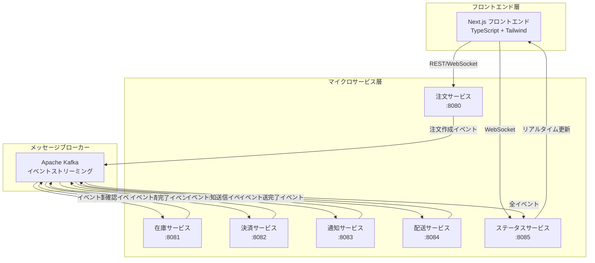
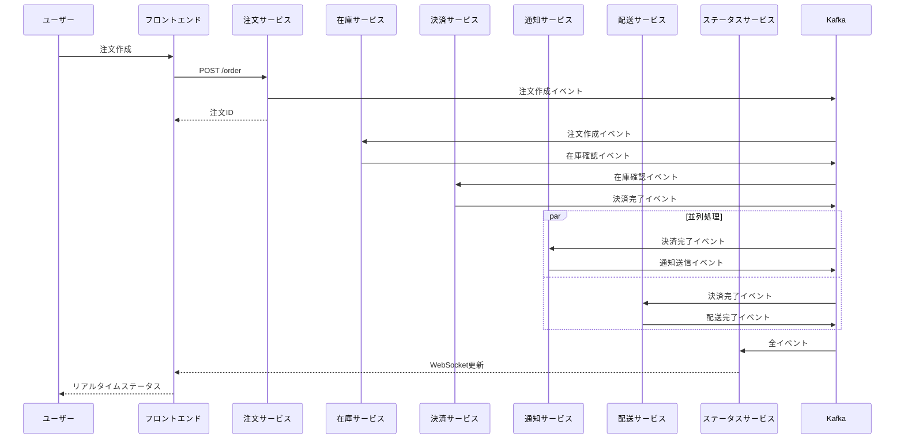

# 🚀 イベント駆動型ECマイクロサービス

[](https://golang.org/)
[](https://nextjs.org/)
[](https://kafka.apache.org/)
[](https://docker.com/)
[](https://kubernetes.io/)

**リアルタイムWebSocket更新機能を備えた、モダンなイベント駆動型マイクロサービスアーキテクチャによるEコマース注文処理システム**

## 🎯 プロジェクト概要

このプロジェクトは、高スケールなEコマース注文処理のための**完全なイベント駆動型マイクロサービスシステム**を実証します。イベントソーシング、CQRS、WebSocketによるリアルタイム通信などのモダンアーキテクチャパターンを採用しています。

### ✨ 主要機能

- 🔄 **イベント駆動アーキテクチャ** - 全サービスがKafkaイベントで通信
- ⚡ **リアルタイム更新** - WebSocketによるライブ注文追跡
- 🏗️ **マイクロサービス** - 独立した疎結合サービス
- 📱 **モダンUI** - React/Next.js + Tailwind CSS + TypeScript
- 🐳 **コンテナネイティブ** - Docker & Kubernetes完全対応
- ☁️ **クラウド対応** - AWS EKSデプロイメント対応
- 🔍 **可観測性** - ヘルスチェックとモニタリング対応
- 🧪 **テストカバレッジ** - 包括的テスト戦略

## 🏛️ システム構成



## 🚦 クイックスタート

### 前提条件

- Docker & Docker Compose
- （オプション）ローカル開発用 Go 1.21+
- （オプション）フロントエンド開発用 Node.js 18+

### 🎬 ワンコマンドセットアップ

```bash
# リポジトリのクローンとシステム全体の起動
git clone <repository-url>
cd kubernetes-event-driven-service

# 全サービス起動（バックエンド + フロントエンド）
make run-local

# ブラウザでフロントエンドを開く
make open-frontend
```

これで完了！システムは以下のURLで利用可能になります：
- **フロントエンド**: http://localhost:3000
- **注文API**: http://localhost:8080
- **ステータスAPI**: http://localhost:8085

### 🧪 システムのテスト

```bash
# テスト注文の作成
make test-order

# 在庫レベルの確認
make test-inventory

# 注文ステータスの確認
make test-status
```

## 🛠️ 開発環境セットアップ

### ローカル開発

```bash
# バックエンドサービスのみ起動
docker-compose up -d zookeeper kafka order-service inventory-service payment-service notification-service shipping-service status-service

# フロントエンドを開発モードで起動
cd frontend
npm install
npm run dev
```

### 利用可能サービス

| サービス | ポート | 用途 | ヘルスチェック |
|---------|------|------|--------------|
| **フロントエンド** | 3000 | React/Next.js UI | <http://localhost:3000> |
| **注文サービス** | 8080 | 注文作成 | <http://localhost:8080/health> |
| **在庫サービス** | 8081 | 在庫管理 | <http://localhost:8081/health> |
| **決済サービス** | 8082 | 決済処理 | <http://localhost:8082/health> |
| **通知サービス** | 8083 | 顧客通知 | <http://localhost:8083/health> |
| **配送サービス** | 8084 | 配送・追跡 | <http://localhost:8084/health> |
| **ステータスサービス** | 8085 | 注文追跡 + WebSocket | <http://localhost:8085/health> |
| **Kafka** | 9092 | メッセージブローカー | - |
| **Zookeeper** | 2181 | Kafka調整 | - |

## 📊 イベントフロー

システムはイベント駆動ワークフローで注文を処理します：



## 🎮 インタラクティブデモ

### 1. **ダッシュボード表示**

- リアルタイム注文統計
- 在庫レベル監視
- 全注文の現在ステータス表示

### 2. **注文作成**

- 商品選択（プレミアムウィジェット、デラックスガジェット、エリートデバイス）
- 数量選択（在庫検証付き）
- リアルタイム価格計算

### 3. **リアルタイム追跡**

- 注文の進行状況をリアルタイム監視
- タイムスタンプ付きイベントタイムライン
- 配送追跡番号取得
- WebSocket接続状態インジケーター

### 4. **イベントタイムライン**

各注文の完全なイベント履歴を表示：

- ✅ **注文作成** → ✅ **在庫確認** → ✅ **決済完了** → ✅ **通知送信** → ✅ **配送完了**

## 🏗️ アーキテクチャのハイライト

### マイクロサービスパターン

- **単一責任原則**: 各サービスは集中したビジネス機能を持つ
- **サービス毎のデータベース**: 独立したデータ管理（現在はインメモリ）
- **分散化**: 中央オーケストレーターなし、純粋なイベント駆動調整

### イベントソーシング

- **イベントストア**: Kafkaがシステムのメモリとして機能
- **イベント再生**: イベントから状態を再構築する能力
- **監査証跡**: すべてのビジネスイベントの完全な履歴

### CQRS（コマンドクエリ責任分離）

- **コマンド**: 書き込み操作（注文作成、在庫予約）
- **クエリ**: 読み込み操作（注文ステータス、在庫レベル）
- **分離モデル**: 異なるアクセスパターンに最適化

### リアルタイム通信

- **WebSocket**: 双方向リアルタイム更新
- **Server-Sent Events**: ステータス更新の代替手段
- **接続管理**: 自動再接続とエラーハンドリング

## 🚀 デプロイメントオプション

### Docker Compose（ローカル/開発環境）

```bash
# 全サービス
docker-compose up -d

# 特定サービス
docker-compose up -d kafka order-service frontend
```

### Kubernetes（本番環境）

```bash
# Kafka（Strimzi）のデプロイ
kubectl apply -f deploy/k8s/kafka/

# 全マイクロサービスのデプロイ
kubectl apply -f deploy/k8s/*/deployment.yaml

# または便利スクリプトの使用
./deploy/k8s/deploy-all.sh
```

### AWS EKS（クラウド）

```bash
# EKSクラスターの作成
eksctl create cluster --name ecommerce-cluster --region us-west-2

# Helmでのデプロイ（将来）
helm install ecommerce ./helm/ecommerce
```

## 🔧 設定

### 環境変数

```bash
# Kafka設定
KAFKA_BROKER=localhost:9092

# サービスポート（Docker Composeで自動設定）
ORDER_SERVICE_PORT=8080
INVENTORY_SERVICE_PORT=8081
PAYMENT_SERVICE_PORT=8082
NOTIFICATION_SERVICE_PORT=8083
SHIPPING_SERVICE_PORT=8084
STATUS_SERVICE_PORT=8085
FRONTEND_PORT=3000
```

### 商品カタログ（設定可能）

```go
// 現在の商品設定
products := map[string]ProductInfo{
    "product-1": {Name: "プレミアムウィジェット", Price: 29.99, InitialStock: 100},
    "product-2": {Name: "デラックスガジェット", Price: 49.99, InitialStock: 50},
    "product-3": {Name: "エリートデバイス", Price: 99.99, InitialStock: 25},
}
```

## 📈 モニタリング & 可観測性

### ヘルスチェック

全サービスが `/health` エンドポイントを提供：

```bash
# 全サービスのヘルス確認
make health-check

# 個別サービスのヘルス確認
curl http://localhost:8080/health
curl http://localhost:8081/health
# ... など
```

### メトリクス（将来実装予定）

- Prometheusメトリクスエンドポイント
- Grafanaダッシュボード
- Jaeger分散トレーシング
- ELKスタックによる集中ログ

### 現在のログ機能

- 構造化JSONログ
- リクエスト/レスポンスログ
- エラー追跡
- イベント処理ログ

## 🧪 テスト

### テストピラミッド

```bash
# ユニットテスト
make test-unit

# 統合テスト
make test-integration

# エンドツーエンドテスト
make test-e2e

# パフォーマンステスト
make test-performance
```

### テストカバレッジ

- **ユニットテスト**: ビジネスロジックとイベントハンドリング
- **統合テスト**: サービス間通信
- **エンドツーエンドテスト**: 完全なユーザーワークフロー
- **パフォーマンステスト**: 負荷・ストレステスト

## 📚 ドキュメント

- 📋 **[ARCHITECTURE.md](ARCHITECTURE.md)** - 完全なシステムアーキテクチャ
- 🔧 **[TECHNICAL_SPECIFICATION.md](TECHNICAL_SPECIFICATION.md)** - 詳細技術仕様
- 🎯 **[CLAUDE.md](CLAUDE.md)** - 元のプロジェクト要件
- 📖 **API Documentation** - OpenAPI/Swagger仕様（各サービス内）

## 🤝 コントリビューション

### 開発ワークフロー

1. **リポジトリをフォーク**
2. **機能ブランチ作成**: `git checkout -b feature/amazing-feature`
3. **テスト付きで変更**
4. **品質チェック実行**: `make lint test`
5. **従来型コミット**: `feat: add amazing feature`
6. **プッシュしてプルリクエスト作成**

### コード標準

- **Go**: Effective Goガイドライン準拠、`gofmt` 使用
- **TypeScript**: ESLint + Prettier設定
- **コミット**: Conventional Commitsフォーマット
- **テスト**: 80%以上のカバレッジ維持

## 📋 Makefileコマンド

```bash
# 開発
make build-local          # 全Dockerイメージビルド
make run-local            # 全サービス起動
make stop-local           # 全サービス停止
make logs-local           # サービスログ表示

# テスト
make test-order           # テスト注文作成
make test-inventory       # 在庫確認
make test-status          # 注文ステータス確認

# Kubernetes
make build-k8s            # Kubernetes用ビルド
make deploy-k8s           # Kubernetesへデプロイ
make clean-k8s            # Kubernetesリソースクリーン

# ユーティリティ
make open-frontend        # ブラウザでフロントエンド開く
make port-forward         # K8sポートフォワード設定
make health-check         # 全サービスヘルス確認
```

## 🔮 ロードマップ

### フェーズ2 - 機能強化

- [ ] ユーザー認証（JWT/OAuth2）
- [ ] 注文キャンセルワークフロー
- [ ] 在庫補充イベント
- [ ] 決済返金処理
- [ ] 多通貨対応

### フェーズ3 - 高度な機能

- [ ] データベース永続化（PostgreSQL）
- [ ] キャッシュ層（Redis）
- [ ] サービスメッシュ（Istio）
- [ ] 高度なモニタリング（Prometheus/Grafana）
- [ ] 需要予測機械学習

### フェーズ4 - エンタープライズ機能

- [ ] マルチテナントアーキテクチャ
- [ ] A/Bテストフレームワーク
- [ ] 高度な分析
- [ ] モバイルアプリ（React Native）
- [ ] マルチリージョンデプロイ

## 📄 ライセンス

このプロジェクトはMITライセンスの下でライセンスされています - 詳細は[LICENSE](LICENSE)ファイルを参照してください。

## 🆘 サポート

- 📧 **課題**: [GitHub Issues](https://github.com/your-org/event-driven-ecommerce/issues)
- 💬 **ディスカッション**: [GitHub Discussions](https://github.com/your-org/event-driven-ecommerce/discussions)
- 📖 **ドキュメント**: [プロジェクトWiki](https://github.com/your-org/event-driven-ecommerce/wiki)

## ⭐ 謝辞

- **Apache Kafka** - イベントストリーミングプラットフォーム
- **Strimzi** - Kubernetes Kafkaオペレーター
- **Gin Framework** - Go HTTP Webフレームワーク
- **Next.js** - 本番対応Reactフレームワーク
- **Tailwind CSS** - ユーティリティファーストCSSフレームワーク

---

🎉 **ハッピーコーディング！** 🎉

モダンなイベント駆動アーキテクチャパターンで❤️を込めて作成

[⬆ トップに戻る](#-イベント駆動型ecマイクロサービス)