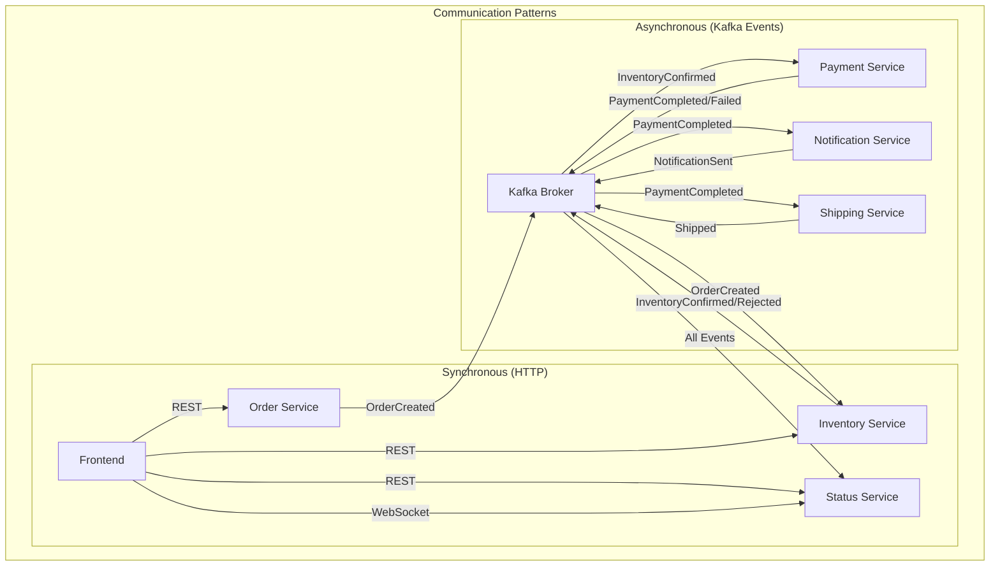
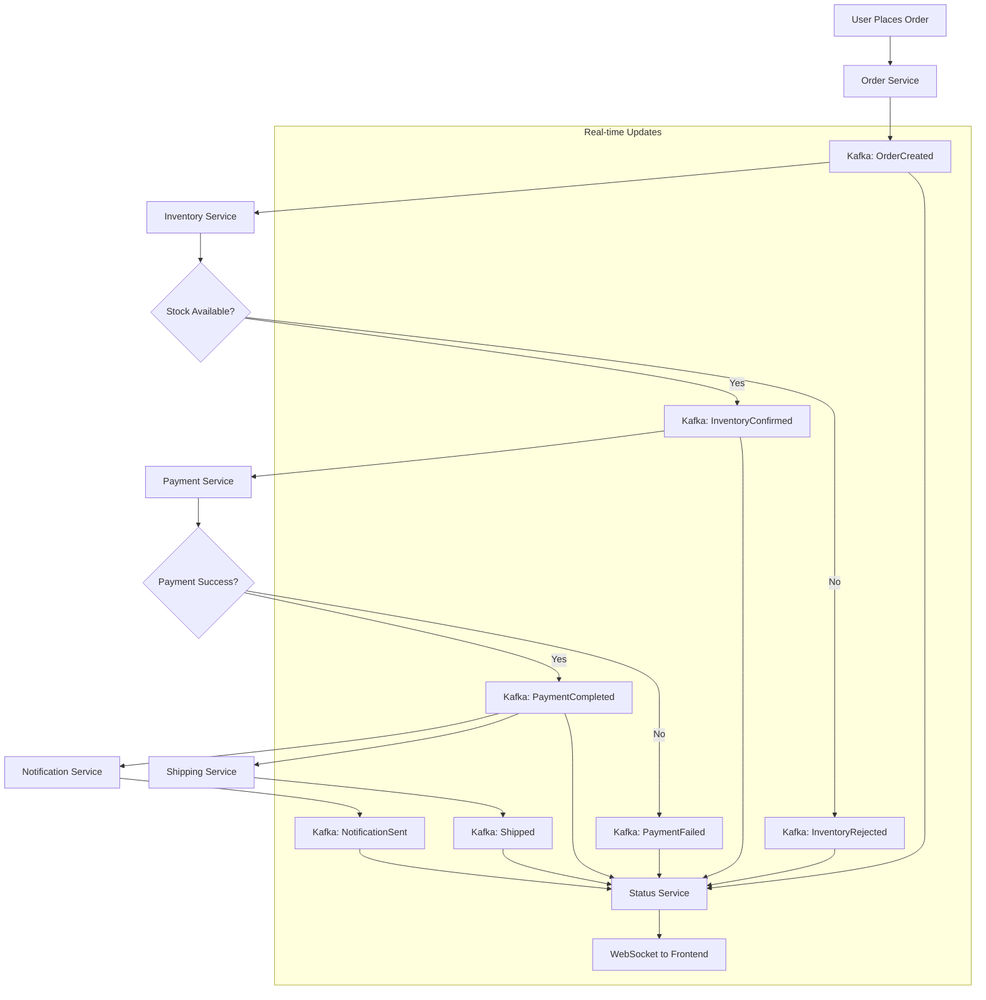
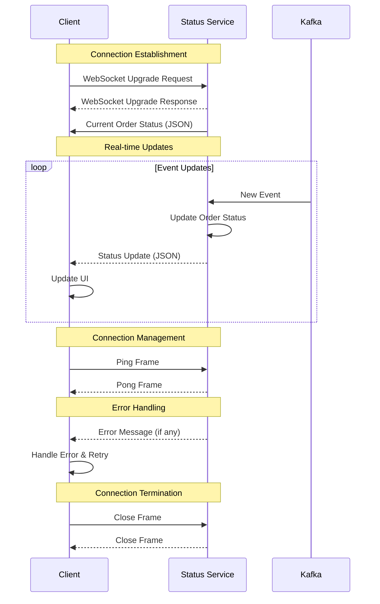

# 🔧 Technical Specification Document

## Event-Driven E-Commerce Microservices System

---

## 📋 Table of Contents

- [1. System Architecture Deep Dive](#1-system-architecture-deep-dive)
- [2. Service Implementation Details](#2-service-implementation-details)
- [3. Event Schema & Message Formats](#3-event-schema--message-formats)
- [4. Database Design & Data Flow](#4-database-design--data-flow)
- [5. API Specification](#5-api-specification)
- [6. WebSocket Protocol](#6-websocket-protocol)
- [7. Infrastructure Configuration](#7-infrastructure-configuration)
- [8. Performance & Scalability](#8-performance--scalability)
- [9. Error Handling & Recovery](#9-error-handling--recovery)
- [10. Testing Specifications](#10-testing-specifications)

---

## 1. System Architecture Deep Dive

### 1.1 Microservices Communication Matrix



### 1.2 Data Flow Architecture



### 1.3 Service Dependency Matrix

| Service | Depends On | Provides To | Event Topics |
|---------|------------|-------------|--------------|
| Order Service | Kafka | Frontend, Inventory Service | `orders` (produce) |
| Inventory Service | Kafka | Payment Service | `orders` (consume), `inventory` (produce) |
| Payment Service | Kafka | Notification, Shipping Services | `inventory` (consume), `payment` (produce) |
| Notification Service | Kafka | Status Service | `payment` (consume), `notification` (produce) |
| Shipping Service | Kafka | Status Service | `payment` (consume), `shipping` (produce) |
| Status Service | Kafka | Frontend (WebSocket/REST) | All topics (consume) |

---

## 2. Service Implementation Details

### 2.1 Order Service Technical Specification

**Service Responsibilities:**
- Order creation and validation
- Order ID generation (UUID v4)
- Initial order state management
- Kafka event publishing for order lifecycle

**Implementation Details:**
```go
// Main Application Structure
type OrderService struct {
    kafkaWriter *kafka.Writer
    logger      *log.Logger
}

// HTTP Handler Implementation
func (os *OrderService) createOrder(c *gin.Context) {
    // 1. Request validation
    var req OrderRequest
    if err := c.ShouldBindJSON(&req); err != nil {
        c.JSON(http.StatusBadRequest, gin.H{"error": err.Error()})
        return
    }
    
    // 2. Order ID generation
    orderID := uuid.New().String()
    
    // 3. Event creation
    event := OrderCreatedEvent{
        OrderID:   orderID,
        ProductID: req.ProductID,
        Quantity:  req.Quantity,
        EventType: "OrderCreated",
    }
    
    // 4. Kafka publishing with error handling
    if err := os.publishEvent(event); err != nil {
        log.Printf("Kafka publish error: %v", err)
        c.JSON(http.StatusInternalServerError, gin.H{"error": "Order creation failed"})
        return
    }
    
    // 5. Success response
    c.JSON(http.StatusCreated, CreateOrderResponse{...})
}

// Kafka Configuration
kafkaWriter := &kafka.Writer{
    Addr:         kafka.TCP("kafka:9092"),
    Topic:        "orders",
    Balancer:     &kafka.LeastBytes{},
    RequiredAcks: kafka.RequireOne,
    Async:        false,
}
```

**Error Handling Strategy:**
- Input validation with Gin binding
- Kafka connection retry mechanism
- Graceful degradation on Kafka unavailability
- Structured error responses

**Performance Considerations:**
- Connection pooling for Kafka
- Request timeout configuration (10 seconds)
- Graceful shutdown handling
- Memory-efficient JSON serialization

### 2.2 Inventory Service Technical Specification

**Service Responsibilities:**
- Stock level management
- Inventory reservation logic
- Stock availability checking
- Concurrent access handling

**Implementation Details:**
```go
// Thread-safe Inventory Management
type Inventory struct {
    mu    sync.RWMutex
    stock map[string]int
}

// Stock Reservation Algorithm
func (inv *Inventory) ReserveStock(productID string, quantity int) bool {
    inv.mu.Lock()
    defer inv.mu.Unlock()
    
    currentStock, exists := inv.stock[productID]
    if !exists {
        return false
    }
    
    if currentStock >= quantity {
        inv.stock[productID] -= quantity
        return true
    }
    
    return false
}

// Kafka Consumer Configuration
consumerConfig := kafka.ReaderConfig{
    Brokers:     []string{"kafka:9092"},
    Topic:       "orders",
    GroupID:     "inventory-service",
    StartOffset: kafka.LastOffset,
    MaxBytes:    10e6, // 10MB
    MaxWait:     1 * time.Second,
}

// Event Processing Loop
func (is *InventoryService) processOrderEvents() {
    for {
        msg, err := is.reader.ReadMessage(context.Background())
        if err != nil {
            log.Printf("Kafka read error: %v", err)
            continue
        }
        
        var event OrderCreatedEvent
        if err := json.Unmarshal(msg.Value, &event); err != nil {
            log.Printf("Event unmarshal error: %v", err)
            continue
        }
        
        // Business logic execution
        if is.inventory.ReserveStock(event.ProductID, event.Quantity) {
            is.publishInventoryEvent("InventoryConfirmed", event)
        } else {
            is.publishInventoryEvent("InventoryRejected", event)
        }
    }
}
```

**Concurrency Handling:**
- Read-write mutex for stock operations
- Atomic operations for inventory updates
- Consumer group for horizontal scaling
- Idempotent event processing

### 2.3 Status Service Technical Specification

**Service Responsibilities:**
- Event aggregation from all topics
- Order state reconstruction
- WebSocket connection management
- Real-time status broadcasting

**Implementation Details:**
```go
// Status Manager with WebSocket Support
type StatusManager struct {
    mu      sync.RWMutex
    orders  map[string]*Order
    clients map[string][]*websocket.Conn
}

// WebSocket Upgrader Configuration
var upgrader = websocket.Upgrader{
    ReadBufferSize:  1024,
    WriteBufferSize: 1024,
    CheckOrigin: func(r *http.Request) bool {
        return true // Allow all origins for development
    },
}

// Multi-topic Consumer Implementation
func (ss *StatusService) consumeAllEvents() {
    topics := []string{"orders", "inventory", "payment", "notification", "shipping"}
    
    for _, topic := range topics {
        go ss.consumeTopicEvents(topic)
    }
}

func (ss *StatusService) consumeTopicEvents(topic string) {
    reader := kafka.NewReader(kafka.ReaderConfig{
        Brokers: []string{"kafka:9092"},
        Topic:   topic,
        GroupID: "status-service",
    })
    defer reader.Close()
    
    for {
        msg, err := reader.ReadMessage(context.Background())
        if err != nil {
            continue
        }
        
        ss.processEvent(topic, msg.Value)
    }
}

// Real-time WebSocket Broadcasting
func (ss *StatusService) broadcastUpdate(orderID string, order *Order) {
    ss.mu.Lock()
    clients := ss.clients[orderID]
    ss.mu.Unlock()
    
    message, _ := json.Marshal(order)
    
    activeClients := []*websocket.Conn{}
    for _, client := range clients {
        if err := client.WriteMessage(websocket.TextMessage, message); err != nil {
            client.Close()
        } else {
            activeClients = append(activeClients, client)
        }
    }
    
    ss.mu.Lock()
    ss.clients[orderID] = activeClients
    ss.mu.Unlock()
}
```

**WebSocket Management:**
- Connection lifecycle management
- Automatic client cleanup
- Heartbeat/ping-pong for connection health
- Message queuing for disconnected clients

---

## 3. Event Schema & Message Formats

### 3.1 Event Schema Specifications

```json
{
  "event_schemas": {
    "OrderCreatedEvent": {
      "type": "object",
      "required": ["order_id", "product_id", "quantity", "event_type"],
      "properties": {
        "order_id": {
          "type": "string",
          "format": "uuid",
          "description": "Unique order identifier"
        },
        "product_id": {
          "type": "string",
          "pattern": "^product-[1-3]$",
          "description": "Product identifier"
        },
        "quantity": {
          "type": "integer",
          "minimum": 1,
          "maximum": 100,
          "description": "Ordered quantity"
        },
        "event_type": {
          "type": "string",
          "enum": ["OrderCreated"],
          "description": "Event type identifier"
        }
      }
    },
    
    "InventoryEvent": {
      "type": "object",
      "required": ["order_id", "product_id", "quantity", "event_type"],
      "properties": {
        "order_id": {"type": "string", "format": "uuid"},
        "product_id": {"type": "string"},
        "quantity": {"type": "integer"},
        "event_type": {
          "type": "string",
          "enum": ["InventoryConfirmed", "InventoryRejected"]
        },
        "reason": {
          "type": "string",
          "description": "Rejection reason if applicable"
        }
      }
    },
    
    "PaymentEvent": {
      "type": "object",
      "required": ["order_id", "product_id", "quantity", "amount", "event_type", "processed_at"],
      "properties": {
        "order_id": {"type": "string", "format": "uuid"},
        "product_id": {"type": "string"},
        "quantity": {"type": "integer"},
        "amount": {
          "type": "number",
          "minimum": 0,
          "description": "Payment amount in USD"
        },
        "event_type": {
          "type": "string",
          "enum": ["PaymentCompleted", "PaymentFailed"]
        },
        "processed_at": {
          "type": "string",
          "format": "date-time",
          "description": "ISO 8601 timestamp"
        },
        "reason": {
          "type": "string",
          "description": "Failure reason if applicable"
        }
      }
    },
    
    "ShippingEvent": {
      "type": "object",
      "required": ["order_id", "product_id", "quantity", "event_type", "tracking_number", "carrier", "shipped_at"],
      "properties": {
        "order_id": {"type": "string", "format": "uuid"},
        "product_id": {"type": "string"},
        "quantity": {"type": "integer"},
        "event_type": {"type": "string", "enum": ["Shipped"]},
        "tracking_number": {
          "type": "string",
          "pattern": "^TRK[a-f0-9]{8}$",
          "description": "Tracking number format"
        },
        "carrier": {
          "type": "string",
          "enum": ["FedEx", "UPS", "DHL", "USPS"],
          "description": "Shipping carrier"
        },
        "estimated_delivery_days": {
          "type": "integer",
          "minimum": 1,
          "maximum": 30
        },
        "shipped_at": {
          "type": "string",
          "format": "date-time"
        }
      }
    }
  }
}
```

### 3.2 Kafka Message Structure

```json
{
  "kafka_message_format": {
    "key": "order_id (string)",
    "value": "event_json (string)",
    "headers": {
      "event-type": "event_type_name",
      "event-version": "v1",
      "producer-service": "service_name",
      "timestamp": "iso8601_timestamp"
    },
    "partition_strategy": "key_based",
    "serialization": "JSON"
  }
}
```

### 3.3 Event Versioning Strategy

```yaml
versioning:
  strategy: "Header-based versioning"
  header_key: "event-version"
  current_version: "v1"
  
  compatibility:
    backward: true
    forward: false
    
  evolution_rules:
    - Add new optional fields only
    - Never remove existing fields
    - Never change field types
    - Use semantic versioning
    
  migration_strategy:
    - Dual-write during transition
    - Consumer adaptation period
    - Old version deprecation
```

---

## 4. Database Design & Data Flow

### 4.1 Current Data Models (In-Memory)

```go
// Order Aggregate Root
type Order struct {
    OrderID         string        `json:"order_id"`
    ProductID       string        `json:"product_id"`
    Quantity        int           `json:"quantity"`
    Status          OrderStatus   `json:"status"`
    Events          []EventRecord `json:"events"`
    LastUpdated     time.Time     `json:"last_updated"`
    TrackingNumber  string        `json:"tracking_number,omitempty"`
    PaymentAmount   float64       `json:"payment_amount,omitempty"`
    CreatedAt       time.Time     `json:"created_at"`
}

// Event Record for Event Sourcing
type EventRecord struct {
    EventID     string    `json:"event_id"`
    EventType   string    `json:"event_type"`
    Data        string    `json:"data"`
    Timestamp   time.Time `json:"timestamp"`
    Version     string    `json:"version"`
}

// Inventory State
type InventoryItem struct {
    ProductID     string    `json:"product_id"`
    CurrentStock  int       `json:"current_stock"`
    ReservedStock int       `json:"reserved_stock"`
    LastUpdated   time.Time `json:"last_updated"`
}

// Order Status Enumeration
type OrderStatus string
const (
    StatusCreated             OrderStatus = "created"
    StatusInventoryConfirmed  OrderStatus = "inventory_confirmed"
    StatusInventoryRejected   OrderStatus = "inventory_rejected"
    StatusPaymentCompleted    OrderStatus = "payment_completed"
    StatusPaymentFailed       OrderStatus = "payment_failed"
    StatusNotificationSent    OrderStatus = "notification_sent"
    StatusShipped            OrderStatus = "shipped"
)
```

### 4.2 Future Database Schema (PostgreSQL)

```sql
-- Orders Table
CREATE TABLE orders (
    order_id        UUID PRIMARY KEY,
    product_id      VARCHAR(50) NOT NULL,
    quantity        INTEGER NOT NULL CHECK (quantity > 0),
    status          VARCHAR(50) NOT NULL,
    payment_amount  DECIMAL(10,2),
    tracking_number VARCHAR(20),
    created_at      TIMESTAMP WITH TIME ZONE DEFAULT NOW(),
    updated_at      TIMESTAMP WITH TIME ZONE DEFAULT NOW(),
    
    INDEX idx_orders_status (status),
    INDEX idx_orders_created_at (created_at)
);

-- Event Store Table
CREATE TABLE events (
    event_id       UUID PRIMARY KEY,
    order_id       UUID NOT NULL,
    event_type     VARCHAR(50) NOT NULL,
    event_data     JSONB NOT NULL,
    event_version  VARCHAR(10) NOT NULL DEFAULT 'v1',
    created_at     TIMESTAMP WITH TIME ZONE DEFAULT NOW(),
    
    FOREIGN KEY (order_id) REFERENCES orders(order_id),
    INDEX idx_events_order_id (order_id),
    INDEX idx_events_type_created (event_type, created_at),
    INDEX gin_events_data (event_data)
);

-- Inventory Table
CREATE TABLE inventory (
    product_id     VARCHAR(50) PRIMARY KEY,
    current_stock  INTEGER NOT NULL CHECK (current_stock >= 0),
    reserved_stock INTEGER NOT NULL DEFAULT 0 CHECK (reserved_stock >= 0),
    updated_at     TIMESTAMP WITH TIME ZONE DEFAULT NOW(),
    
    CHECK (current_stock >= reserved_stock)
);

-- Shipping Information Table
CREATE TABLE shipments (
    shipment_id         UUID PRIMARY KEY,
    order_id            UUID NOT NULL UNIQUE,
    tracking_number     VARCHAR(20) NOT NULL UNIQUE,
    carrier             VARCHAR(20) NOT NULL,
    estimated_days      INTEGER NOT NULL,
    shipped_at          TIMESTAMP WITH TIME ZONE DEFAULT NOW(),
    
    FOREIGN KEY (order_id) REFERENCES orders(order_id),
    INDEX idx_shipments_tracking (tracking_number)
);
```

### 4.3 Data Consistency Patterns

```yaml
consistency_patterns:
  order_creation:
    pattern: "Eventual Consistency"
    description: "Order created immediately, processed asynchronously"
    timeout: "30 seconds for complete processing"
    
  inventory_reservation:
    pattern: "Strong Consistency"
    description: "Atomic stock reservation with mutex"
    isolation: "Serializable for stock operations"
    
  payment_processing:
    pattern: "Saga Pattern"
    description: "Compensating transactions for failures"
    timeout: "10 seconds for payment completion"
    
  status_updates:
    pattern: "Event Sourcing"
    description: "Reconstruct state from events"
    replay: "Full event replay capability"
```

---

## 5. API Specification

### 5.1 OpenAPI Specification (Swagger)

```yaml
openapi: 3.0.3
info:
  title: Event-Driven E-Commerce API
  description: Microservices API for order processing system
  version: 1.0.0
  contact:
    name: API Support
    email: api-support@example.com

servers:
  - url: http://localhost:8080
    description: Order Service
  - url: http://localhost:8085
    description: Status Service

paths:
  /order:
    post:
      tags: [Orders]
      summary: Create new order
      description: Creates a new order and initiates processing workflow
      requestBody:
        required: true
        content:
          application/json:
            schema:
              $ref: '#/components/schemas/CreateOrderRequest'
            examples:
              basic_order:
                summary: Basic order example
                value:
                  product_id: "product-1"
                  quantity: 2
      responses:
        '201':
          description: Order created successfully
          content:
            application/json:
              schema:
                $ref: '#/components/schemas/CreateOrderResponse'
        '400':
          description: Invalid request
          content:
            application/json:
              schema:
                $ref: '#/components/schemas/ErrorResponse'
        '500':
          description: Internal server error
          
  /status/{orderId}:
    get:
      tags: [Status]
      summary: Get order status
      description: Retrieve detailed order status with event history
      parameters:
        - name: orderId
          in: path
          required: true
          description: Unique order identifier
          schema:
            type: string
            format: uuid
      responses:
        '200':
          description: Order status retrieved
          content:
            application/json:
              schema:
                $ref: '#/components/schemas/Order'
        '404':
          description: Order not found

components:
  schemas:
    CreateOrderRequest:
      type: object
      required: [product_id, quantity]
      properties:
        product_id:
          type: string
          enum: [product-1, product-2, product-3]
          description: Product identifier
        quantity:
          type: integer
          minimum: 1
          maximum: 100
          description: Quantity to order
          
    CreateOrderResponse:
      type: object
      properties:
        order_id:
          type: string
          format: uuid
        product_id:
          type: string
        quantity:
          type: integer
        status:
          type: string
          enum: [created]
          
    Order:
      type: object
      properties:
        order_id:
          type: string
          format: uuid
        product_id:
          type: string
        quantity:
          type: integer
        status:
          $ref: '#/components/schemas/OrderStatus'
        events:
          type: array
          items:
            $ref: '#/components/schemas/EventRecord'
        last_updated:
          type: string
          format: date-time
        tracking_number:
          type: string
        payment_amount:
          type: number
          format: float
          
    OrderStatus:
      type: string
      enum:
        - created
        - inventory_confirmed
        - inventory_rejected
        - payment_completed
        - payment_failed
        - notification_sent
        - shipped
        
    EventRecord:
      type: object
      properties:
        event_type:
          type: string
        data:
          type: string
        timestamp:
          type: string
          format: date-time
          
    ErrorResponse:
      type: object
      properties:
        error:
          type: string
        details:
          type: string
        timestamp:
          type: string
          format: date-time
```

### 5.2 Rate Limiting & Security

```yaml
rate_limiting:
  strategy: "Token Bucket"
  limits:
    order_creation: "10 requests/minute per IP"
    status_queries: "60 requests/minute per IP"
    websocket_connections: "5 concurrent per IP"
    
  headers:
    - "X-RateLimit-Limit"
    - "X-RateLimit-Remaining" 
    - "X-RateLimit-Reset"

security:
  cors:
    enabled: true
    allowed_origins: ["http://localhost:3000"]
    allowed_methods: ["GET", "POST", "OPTIONS"]
    allowed_headers: ["Content-Type", "Authorization"]
    
  headers:
    - "X-Content-Type-Options: nosniff"
    - "X-Frame-Options: DENY"
    - "X-XSS-Protection: 1; mode=block"
```

---

## 6. WebSocket Protocol

### 6.1 WebSocket Connection Lifecycle



### 6.2 WebSocket Message Formats

```typescript
// WebSocket Message Types
interface WebSocketMessage {
  type: 'order_update' | 'error' | 'ping' | 'pong';
  timestamp: string;
  data?: any;
}

// Order Update Message
interface OrderUpdateMessage extends WebSocketMessage {
  type: 'order_update';
  data: {
    order_id: string;
    status: OrderStatus;
    events: EventRecord[];
    last_updated: string;
    tracking_number?: string;
    payment_amount?: number;
  };
}

// Error Message
interface ErrorMessage extends WebSocketMessage {
  type: 'error';
  data: {
    code: string;
    message: string;
    details?: string;
  };
}

// Ping/Pong for Connection Health
interface PingPongMessage extends WebSocketMessage {
  type: 'ping' | 'pong';
}
```

### 6.3 Client-Side WebSocket Implementation

```typescript
class OrderWebSocketClient {
  private ws: WebSocket | null = null;
  private orderId: string;
  private reconnectAttempts = 0;
  private maxReconnectAttempts = 5;
  private pingInterval: NodeJS.Timeout | null = null;
  
  constructor(
    orderId: string,
    private onMessage: (data: any) => void,
    private onError: (error: Error) => void,
    private onStatusChange: (connected: boolean) => void
  ) {
    this.orderId = orderId;
  }
  
  connect(): void {
    try {
      const wsUrl = `ws://${window.location.hostname}:8085/ws/${this.orderId}`;
      this.ws = new WebSocket(wsUrl);
      
      this.ws.onopen = this.handleOpen.bind(this);
      this.ws.onmessage = this.handleMessage.bind(this);
      this.ws.onclose = this.handleClose.bind(this);
      this.ws.onerror = this.handleError.bind(this);
      
    } catch (error) {
      this.onError(new Error(`WebSocket connection failed: ${error}`));
    }
  }
  
  private handleOpen(): void {
    console.log(`WebSocket connected for order: ${this.orderId}`);
    this.reconnectAttempts = 0;
    this.onStatusChange(true);
    this.startPingInterval();
  }
  
  private handleMessage(event: MessageEvent): void {
    try {
      const message: WebSocketMessage = JSON.parse(event.data);
      
      switch (message.type) {
        case 'order_update':
          this.onMessage(message.data);
          break;
        case 'error':
          this.onError(new Error(message.data.message));
          break;
        case 'pong':
          // Connection health confirmed
          break;
      }
    } catch (error) {
      this.onError(new Error('Failed to parse WebSocket message'));
    }
  }
  
  private handleClose(event: CloseEvent): void {
    console.log(`WebSocket closed: ${event.code} ${event.reason}`);
    this.onStatusChange(false);
    this.stopPingInterval();
    
    if (event.code !== 1000) { // Not a normal closure
      this.attemptReconnect();
    }
  }
  
  private handleError(error: Event): void {
    console.error('WebSocket error:', error);
    this.onError(new Error('WebSocket connection error'));
  }
  
  private attemptReconnect(): void {
    if (this.reconnectAttempts < this.maxReconnectAttempts) {
      this.reconnectAttempts++;
      const delay = 2000 * this.reconnectAttempts;
      
      console.log(`Reconnection attempt ${this.reconnectAttempts} in ${delay}ms`);
      
      setTimeout(() => {
        this.connect();
      }, delay);
    } else {
      this.onError(new Error('Maximum reconnection attempts reached'));
    }
  }
  
  private startPingInterval(): void {
    this.pingInterval = setInterval(() => {
      if (this.ws?.readyState === WebSocket.OPEN) {
        this.ws.send(JSON.stringify({ type: 'ping', timestamp: new Date().toISOString() }));
      }
    }, 30000); // Ping every 30 seconds
  }
  
  private stopPingInterval(): void {
    if (this.pingInterval) {
      clearInterval(this.pingInterval);
      this.pingInterval = null;
    }
  }
  
  disconnect(): void {
    this.stopPingInterval();
    if (this.ws) {
      this.ws.close(1000, 'Client disconnect');
      this.ws = null;
    }
  }
}
```

---

## 7. Infrastructure Configuration

### 7.1 Docker Configuration Details

```dockerfile
# Multi-stage Dockerfile for Go Services
FROM golang:1.21-alpine AS builder
WORKDIR /app
COPY go.mod go.sum ./
COPY . .
RUN go mod tidy && \
    CGO_ENABLED=0 GOOS=linux go build -a -installsuffix cgo -o main .

FROM alpine:latest
RUN apk --no-cache add ca-certificates tzdata
WORKDIR /root/
COPY --from=builder /app/main .
EXPOSE 8080
HEALTHCHECK --interval=30s --timeout=3s --start-period=5s --retries=3 \
  CMD wget --no-verbose --tries=1 --spider http://localhost:8080/health || exit 1
CMD ["./main"]
```

```dockerfile
# Next.js Frontend Dockerfile
FROM node:18-alpine AS deps
RUN apk add --no-cache libc6-compat
WORKDIR /app
COPY package.json ./
RUN npm install

FROM node:18-alpine AS builder
WORKDIR /app
COPY --from=deps /app/node_modules ./node_modules
COPY . .
RUN npm run build

FROM node:18-alpine AS runner
WORKDIR /app
ENV NODE_ENV production
RUN addgroup --system --gid 1001 nodejs && \
    adduser --system --uid 1001 nextjs
COPY --from=builder /app/public ./public
COPY --from=builder --chown=nextjs:nodejs /app/.next/standalone ./
COPY --from=builder --chown=nextjs:nodejs /app/.next/static ./.next/static
USER nextjs
EXPOSE 3000
ENV PORT 3000
ENV HOSTNAME "0.0.0.0"
CMD ["node", "server.js"]
```

### 7.2 Kubernetes Resource Specifications

```yaml
# Service Resource Template
apiVersion: v1
kind: Service
metadata:
  name: order-service
  labels:
    app: order-service
    version: v1
spec:
  selector:
    app: order-service
  ports:
  - name: http
    port: 8080
    targetPort: 8080
    protocol: TCP
  type: ClusterIP

---
# Deployment Resource Template
apiVersion: apps/v1
kind: Deployment
metadata:
  name: order-service
  labels:
    app: order-service
    version: v1
spec:
  replicas: 2
  selector:
    matchLabels:
      app: order-service
  template:
    metadata:
      labels:
        app: order-service
        version: v1
    spec:
      containers:
      - name: order-service
        image: order-service:latest
        imagePullPolicy: IfNotPresent
        ports:
        - containerPort: 8080
          name: http
        env:
        - name: KAFKA_BROKER
          value: "my-cluster-kafka-bootstrap:9092"
        - name: PORT
          value: "8080"
        resources:
          requests:
            memory: "128Mi"
            cpu: "100m"
          limits:
            memory: "512Mi"
            cpu: "500m"
        livenessProbe:
          httpGet:
            path: /health
            port: 8080
          initialDelaySeconds: 30
          periodSeconds: 10
          timeoutSeconds: 5
          failureThreshold: 3
        readinessProbe:
          httpGet:
            path: /health
            port: 8080
          initialDelaySeconds: 5
          periodSeconds: 5
          timeoutSeconds: 3
          failureThreshold: 3
      restartPolicy: Always
```

### 7.3 Kafka Configuration (Strimzi)

```yaml
apiVersion: kafka.strimzi.io/v1beta2
kind: Kafka
metadata:
  name: my-cluster
  namespace: kafka
spec:
  kafka:
    version: 3.6.0
    replicas: 3
    listeners:
      - name: plain
        port: 9092
        type: internal
        tls: false
      - name: tls
        port: 9093
        type: internal
        tls: true
    config:
      # Kafka broker configuration
      offsets.topic.replication.factor: 3
      transaction.state.log.replication.factor: 3
      transaction.state.log.min.isr: 2
      default.replication.factor: 3
      min.insync.replicas: 2
      inter.broker.protocol.version: "3.6"
      
      # Performance tuning
      num.network.threads: 8
      num.io.threads: 16
      socket.send.buffer.bytes: 102400
      socket.receive.buffer.bytes: 102400
      socket.request.max.bytes: 104857600
      
      # Log settings
      log.retention.hours: 168
      log.segment.bytes: 1073741824
      log.retention.check.interval.ms: 300000
      
    storage:
      type: persistent-claim
      size: 100Gi
      class: gp3
    
    metricsConfig:
      type: jmxPrometheusExporter
      valueFrom:
        configMapKeyRef:
          name: kafka-metrics
          key: kafka-metrics-config.yml
          
  zookeeper:
    replicas: 3
    storage:
      type: persistent-claim
      size: 10Gi
      class: gp3
    metricsConfig:
      type: jmxPrometheusExporter
      valueFrom:
        configMapKeyRef:
          name: kafka-metrics
          key: zookeeper-metrics-config.yml
          
  entityOperator:
    topicOperator: {}
    userOperator: {}
```

---

## 8. Performance & Scalability

### 8.1 Performance Targets

```yaml
performance_targets:
  api_response_times:
    order_creation: "< 200ms (P95)"
    status_retrieval: "< 100ms (P95)"
    inventory_check: "< 50ms (P95)"
    
  throughput:
    orders_per_second: "1000 req/s"
    concurrent_websocket_connections: "10000"
    kafka_message_throughput: "50000 msg/s"
    
  availability:
    system_uptime: "99.9%"
    maximum_downtime: "8.77 hours/year"
    recovery_time_objective: "< 5 minutes"
    
  scalability:
    horizontal_scaling: "Auto-scaling based on CPU/Memory"
    maximum_pods: "50 per service"
    kafka_partitions: "Auto-scaling based on consumer lag"
```

### 8.2 Resource Requirements

```yaml
resource_requirements:
  order_service:
    cpu_request: "100m"
    cpu_limit: "500m"
    memory_request: "128Mi"
    memory_limit: "512Mi"
    replicas: 2-5
    
  status_service:
    cpu_request: "200m"
    cpu_limit: "1000m"
    memory_request: "256Mi"
    memory_limit: "1Gi"
    replicas: 2-8
    
  kafka_cluster:
    brokers: 3
    cpu_per_broker: "1000m"
    memory_per_broker: "2Gi"
    storage_per_broker: "100Gi"
    
  frontend:
    cpu_request: "100m"
    cpu_limit: "200m"
    memory_request: "64Mi"
    memory_limit: "256Mi"
    replicas: 2-4
```

### 8.3 Auto-scaling Configuration

```yaml
apiVersion: autoscaling/v2
kind: HorizontalPodAutoscaler
metadata:
  name: order-service-hpa
spec:
  scaleTargetRef:
    apiVersion: apps/v1
    kind: Deployment
    name: order-service
  minReplicas: 2
  maxReplicas: 10
  metrics:
  - type: Resource
    resource:
      name: cpu
      target:
        type: Utilization
        averageUtilization: 70
  - type: Resource
    resource:
      name: memory
      target:
        type: Utilization
        averageUtilization: 80
  behavior:
    scaleDown:
      stabilizationWindowSeconds: 300
      policies:
      - type: Percent
        value: 10
        periodSeconds: 60
    scaleUp:
      stabilizationWindowSeconds: 60
      policies:
      - type: Percent
        value: 50
        periodSeconds: 60
```

---

## 9. Error Handling & Recovery

### 9.1 Error Categories & Handling

```yaml
error_handling:
  validation_errors:
    http_status: 400
    response_format: "JSON with error details"
    retry_strategy: "Client-side validation"
    
  business_logic_errors:
    insufficient_inventory:
      event: "InventoryRejected"
      recovery: "User notification + order cancellation"
    payment_failure:
      event: "PaymentFailed" 
      recovery: "Retry payment or manual intervention"
      
  infrastructure_errors:
    kafka_unavailable:
      strategy: "Circuit breaker pattern"
      fallback: "Store in local queue"
      recovery: "Automatic reconnection + event replay"
    database_connection:
      strategy: "Connection pooling + retries"
      timeout: "10 seconds"
      
  network_errors:
    websocket_disconnection:
      strategy: "Exponential backoff reconnection"
      max_attempts: 5
      base_delay: "2 seconds"
```

### 9.2 Circuit Breaker Implementation

```go
type CircuitBreaker struct {
    maxFailures  int
    resetTimeout time.Duration
    mutex        sync.RWMutex
    failures     int
    lastFailTime time.Time
    state        CircuitState
}

type CircuitState int
const (
    StateClosed CircuitState = iota
    StateOpen
    StateHalfOpen
)

func (cb *CircuitBreaker) Call(operation func() error) error {
    cb.mutex.RLock()
    state := cb.state
    failures := cb.failures
    cb.mutex.RUnlock()
    
    switch state {
    case StateOpen:
        if time.Since(cb.lastFailTime) > cb.resetTimeout {
            cb.setState(StateHalfOpen)
            return cb.executeOperation(operation)
        }
        return errors.New("circuit breaker is open")
        
    case StateHalfOpen:
        return cb.executeOperation(operation)
        
    case StateClosed:
        return cb.executeOperation(operation)
    }
    
    return nil
}

func (cb *CircuitBreaker) executeOperation(operation func() error) error {
    err := operation()
    
    cb.mutex.Lock()
    defer cb.mutex.Unlock()
    
    if err != nil {
        cb.failures++
        cb.lastFailTime = time.Now()
        
        if cb.failures >= cb.maxFailures {
            cb.state = StateOpen
        }
        return err
    }
    
    // Success - reset circuit breaker
    cb.failures = 0
    cb.state = StateClosed
    return nil
}
```

### 9.3 Event Replay & Recovery

```yaml
event_replay:
  triggers:
    - Service restart with data loss
    - Consumer lag exceeding threshold
    - Manual recovery request
    
  strategy:
    1. "Identify last processed event"
    2. "Reset consumer offset"
    3. "Replay events from last checkpoint"
    4. "Deduplicate events using idempotency keys"
    5. "Verify state consistency"
    
  configuration:
    replay_batch_size: 1000
    replay_rate_limit: "100 events/second"
    max_replay_window: "24 hours"
    
  monitoring:
    - Replay progress metrics
    - State consistency checks
    - Performance impact monitoring
```

---

## 10. Testing Specifications

### 10.1 Testing Strategy Overview

```yaml
testing_pyramid:
  unit_tests:
    coverage: "80%"
    framework: "Go testing + testify"
    focus: "Business logic, event handling"
    
  integration_tests:
    coverage: "API endpoints, Kafka integration"
    framework: "Docker Compose test environment"
    focus: "Service-to-service communication"
    
  end_to_end_tests:
    coverage: "Complete order workflows"
    framework: "Playwright + test environment"
    focus: "User journey validation"
    
  performance_tests:
    framework: "k6 + Grafana"
    scenarios:
      - Load testing (normal traffic)
      - Stress testing (peak traffic)
      - Spike testing (sudden traffic increases)
      - Endurance testing (sustained load)
```

### 10.2 Unit Test Examples

```go
// Order Service Unit Tests
func TestCreateOrder_Success(t *testing.T) {
    // Arrange
    mockKafkaWriter := &MockKafkaWriter{}
    orderService := NewOrderService(mockKafkaWriter)
    
    req := OrderRequest{
        ProductID: "product-1",
        Quantity:  2,
    }
    
    // Act
    response, err := orderService.CreateOrder(req)
    
    // Assert
    assert.NoError(t, err)
    assert.NotEmpty(t, response.OrderID)
    assert.Equal(t, "product-1", response.ProductID)
    assert.Equal(t, 2, response.Quantity)
    assert.Equal(t, "created", response.Status)
    
    // Verify Kafka event was published
    assert.Equal(t, 1, mockKafkaWriter.PublishedEventCount)
    
    publishedEvent := mockKafkaWriter.LastPublishedEvent
    assert.Equal(t, "OrderCreated", publishedEvent.EventType)
}

func TestInventoryService_ReserveStock_Success(t *testing.T) {
    // Arrange
    inventory := NewInventory()
    inventory.SetStock("product-1", 10)
    
    // Act
    success := inventory.ReserveStock("product-1", 5)
    
    // Assert
    assert.True(t, success)
    assert.Equal(t, 5, inventory.GetStock("product-1"))
}

func TestInventoryService_ReserveStock_InsufficientStock(t *testing.T) {
    // Arrange
    inventory := NewInventory()
    inventory.SetStock("product-1", 3)
    
    // Act
    success := inventory.ReserveStock("product-1", 5)
    
    // Assert
    assert.False(t, success)
    assert.Equal(t, 3, inventory.GetStock("product-1"))
}
```

### 10.3 Integration Test Configuration

```yaml
# docker-compose.test.yml
version: '3.8'
services:
  zookeeper-test:
    image: confluentinc/cp-zookeeper:7.4.0
    environment:
      ZOOKEEPER_CLIENT_PORT: 2181
      
  kafka-test:
    image: confluentinc/cp-kafka:7.4.0
    depends_on: [zookeeper-test]
    environment:
      KAFKA_BROKER_ID: 1
      KAFKA_ZOOKEEPER_CONNECT: 'zookeeper-test:2181'
      KAFKA_ADVERTISED_LISTENERS: PLAINTEXT://kafka-test:9092
      KAFKA_AUTO_CREATE_TOPICS_ENABLE: 'true'
      
  order-service-test:
    build: ./services/order-service
    depends_on: [kafka-test]
    environment:
      KAFKA_BROKER: kafka-test:9092
      
  integration-tests:
    build: ./tests/integration
    depends_on: [order-service-test]
    environment:
      ORDER_SERVICE_URL: http://order-service-test:8080
      KAFKA_BROKER: kafka-test:9092
    command: go test -v ./...
```

### 10.4 Performance Test Scenarios

```javascript
// k6 Load Test Script
import http from 'k6/http';
import ws from 'k6/ws';
import { check, sleep } from 'k6';
import { Rate } from 'k6/metrics';

const errorRate = new Rate('errors');

export const options = {
  scenarios: {
    order_creation_load: {
      executor: 'constant-vus',
      vus: 50,
      duration: '10m',
    },
    websocket_connections: {
      executor: 'constant-vus', 
      vus: 100,
      duration: '5m',
    },
  },
  thresholds: {
    http_req_duration: ['p(95)<200'],
    errors: ['rate<0.01'],
  },
};

export function orderCreationLoad() {
  const payload = JSON.stringify({
    product_id: 'product-1',
    quantity: Math.floor(Math.random() * 5) + 1,
  });
  
  const params = {
    headers: { 'Content-Type': 'application/json' },
  };
  
  const response = http.post('http://localhost:8080/order', payload, params);
  
  const success = check(response, {
    'status is 201': (r) => r.status === 201,
    'order_id present': (r) => JSON.parse(r.body).order_id !== undefined,
  });
  
  if (!success) {
    errorRate.add(1);
  }
  
  sleep(1);
}

export function websocketConnections() {
  const orderId = 'test-order-' + Math.random().toString(36).substr(2, 9);
  const url = `ws://localhost:8085/ws/${orderId}`;
  
  const response = ws.connect(url, null, function (socket) {
    socket.on('open', () => console.log('WebSocket connected'));
    
    socket.on('message', (data) => {
      const message = JSON.parse(data);
      check(message, {
        'valid message format': (m) => m.order_id !== undefined,
      });
    });
    
    socket.setTimeout(() => {
      socket.close();
    }, 30000); // Keep connection for 30 seconds
  });
  
  check(response, {
    'websocket connection successful': (r) => r && r.status === 101,
  });
}
```

---

## 📄 Conclusion

This technical specification provides comprehensive documentation for implementing, deploying, and maintaining the event-driven e-commerce microservices system. The architecture emphasizes scalability, reliability, and real-time capabilities while maintaining loose coupling between services through event-driven communication patterns.

**Key Technical Achievements:**
- ✅ Complete microservices architecture with Go/Gin
- ✅ Event-driven communication via Apache Kafka  
- ✅ Real-time WebSocket integration
- ✅ Modern React/Next.js frontend
- ✅ Container-native deployment ready
- ✅ Comprehensive testing strategy
- ✅ Production-ready error handling
- ✅ Scalable infrastructure design

---

**📝 Document Version**: 1.0.0  
**📅 Last Updated**: August 20, 2025  
**👥 Authors**: Event-Driven Systems Engineering Team